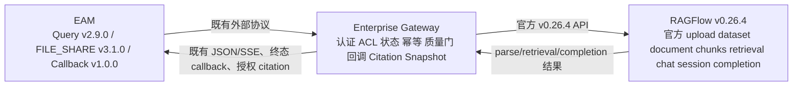

# RAGFlow v0.26.4 官方能力收敛总体计划

> 执行状态：WP00～WP06 已实现并通过离线验收；WP07 已加载本机服务并实跑，当前被 RAGFlow 容器无法解析外部 embedding 域名阻塞，尚无单次全绿 artifact。详见 [`15-RF26-实施与本机验收报告.md`](15-RF26-实施与本机验收报告.md)。

## 结论与成功标准

将 TYrag 的知识库主链收敛到固定的 RAGFlow `v0.26.4`（tag `cb93883f3f8c975eecb2fed81210effeb3bdb06f`）公开能力：官方 upload、dataset/document、chunks、retrieval、chat/session/completions。Gateway 保留企业边界而不重造 RAGFlow：EAM 认证/JWT 用户隔离、ACL 硬前置、业务会话/状态/幂等、解析质量门、终态回调、Citation Snapshot 与授权原件访问。

成功不是“代码能编译”，而是本机 HTTP E2E 证明：FILE_SHARE v3.1.0 的既有外部协议不变，首个 multipart 请求直达官方上传；文档可解析、通过质量门、被 ACL 范围内检索；EAM Query v2.9.0 的 JSON/SSE、会话历史、状态与 citation 语义不变；Callback v1.0.0 只在终态异步投递。不得连接 30 服务器，也不得把离线测试写成生产验收。

## 已锁定的边界

- 证据优先级：当前本地源码与本机 E2E > 官方 `v0.26.4` tag 源码 > tag 文档 > 官网 DEV。发生冲突时按该顺序记录并实现。
- 新 FILE_SHARE 主入口首包直接使用 `POST /api/v1/datasets/{id}/documents` 的 multipart upload；不做双轨、feature flag、fallback 或 alias。
- 完整退役 `RF-PATCH-002`（虚拟 `external://` 文档、换票及两个 executor 分支），但不 DROP 历史表、不迁移历史记录、不清理旧对象；旧数据只保留为可审计遗留。
- legacy v1/document/demo API 继续保留，不能借收敛删除。`RF-PATCH-003`（附件 empty-response）和 `RF-PATCH-004`（Grounding）不属于首包删除范围。
- 不处理设备数量、维修次数、实时状态的精确业务结果；不引入 Sequential-Thinking 主链依赖。EAM 外部线协议若以后必须变化，先提交独立变更说明并等待确认。

## 目标职责图

源文件：[tyrag-v0264-responsibility-boundary.mmd](diagrams/tyrag-v0264-responsibility-boundary.mmd)。为便于审阅，下方嵌入同一源内容；本计划不联网导出图像。

## 分包与依赖

| 顺序 | 工作包 | 交付焦点 | 依赖 |
|---|---|---|---|
| 00 | `RF26-WP00` | 以本地源码冻结 API 与 PATCH/文档漂移事实 | 无 |
| 01 | `RF26-WP01` | FILE_SHARE 直接官方上传，退役 RF-PATCH-002 | WP00 |
| 02 | `RF26-WP02` | 官方解析状态加 Gateway 质量门与既有回调 | WP01 |
| 03 | `RF26-WP03` | ACL 在 retrieval/completion 前硬前置 | WP00、WP02 |
| 04 | `RF26-WP04` | EAM v2.9.0 会话、SSE、业务历史映射 | WP00、WP03 |
| 05 | `RF26-WP05` | Reasoning/WebSearch/Grounding 的既有边界收口 | WP04 |
| 06 | `RF26-WP06` | 单会话附件与 citation snapshot/授权访问 | WP04、WP05 |
| 07 | `RF26-WP07` | 本机 HTTP 端到端验收与最小安全负例 | WP01–WP06 |

WP01 与 WP02 是唯一会动 ingestion 主链的包；WP03–WP06 不得偷偷恢复 `external://` 或绕过质量门。共享 OpenAPI、上游 patch 清单和官方基线由 Lead 最终收口。

## 官方 API 基线

| 能力 | 官方路径 | Gateway 只负责 |
|---|---|---|
| 文件入库 | `POST /api/v1/datasets/{id}/documents` | 验签、幂等、业务元数据、上传编排 |
| 解析/重解析 | `POST /api/v1/datasets/{dataset_id}/chunks`，body 为 `document_ids` | 发起、轮询、质量门、回调 |
| 文档/切片事实 | `GET /api/v1/datasets/{id}/documents?id=...`；`GET .../chunks` | 外部 ID 映射与最小状态解释 |
| 检索 | `POST /api/v1/retrieval` | ACL/设备/active/quality 条件在请求前交集 |
| 会话与回答 | `POST /api/v1/chats/{chat_id}/sessions`；`POST /api/v1/chat/completions` | EAM run、幂等、SSE 映射、业务历史 |
| 会话附件 | `POST /api/v1/documents/upload` | 单会话生命周期与元数据，不能成为持久 KB 写入口 |

文档更新采用当前本地/tag 源码的 `PATCH /api/v1/datasets/{dataset_id}/documents/{document_id}`。tag 文档中仍出现 PUT 的事实必须记录为文档漂移；不得为了兼容文档新增 PUT/alias 补丁。

v0.26.4 没有运行时 upload 的单对象删除 API。WP06 仅保留一个登记为 `RF-PATCH-006` 的认证 `DELETE /api/v1/documents/upload/{file_id}`，用于当前轮附件清理；它不扩展成通用文件管理能力。`RF-PATCH-005` 只补 WebSearch provider 故障时继续内部知识及检索日志脱敏。

## 统一验收与回滚原则

每包先跑本包 unit/contract，再由 WP07 跑真实本机 HTTP E2E；至少有一个未授权/越权/非法输入负例。任何 `200` JSON 业务错误均按失败处理，不当作文件字节或成功响应。回滚按包恢复 Gateway 调用与已登记的最小上游 patch，不删除历史数据、表、索引或对象；不能用“切回双轨”作为回滚，因为双轨不是目标实现。

## 非目标

不升级 RAGFlow、不改官方迁移/模型/文档引擎、不新建 EAM URL 或字段、不接入 30 服务器、不承诺实时业务数据库精确问答、不把 citations 的有无推导为 `completed`/`no_reliable_evidence`/`failed`。
