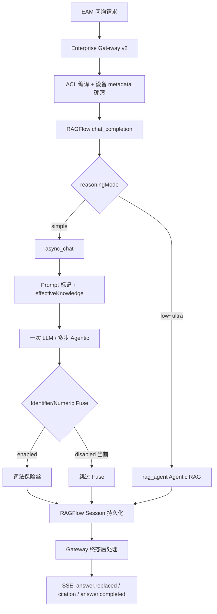

# EAM v2 Grounding Guard 现状与设计说明

- 契约版本：`integration-openapi-v2` **2.9.0**
- 架构决策：[ADR-009](../../decisions/ADR-009-EAM-v2-最小-Grounding-Guard.md)（Superseded）、[ADR-010](../../decisions/ADR-010-EAM-v2-拆除-Grounding-Mega-Switch.md)（当前）
- 上游补丁：`RF-PATCH-004`（`dialog_service.py`、`think_log.py`）
- 更新日期：2026-08-24

## 1. 目标与原则

Grounding Guard 的目标是**降低编造**：在 EAM 正式问询（`/enterprise/api/v2`）中，尽量让模型只陈述检索证据或明确允许的上下文，无法支撑时统一拒答，而不是输出看似合理但无依据的设备参数、工单号或维修记录。

设计原则（ADR-009 / ADR-010）：

| 原则 | 说明 |
|------|------|
| 保险丝，不是第二套推理 | Guard 只做词法/规则校验，不做语义理解、不增加第二次检索或第二模型 |
| 业务状态与 citations 解耦 | `completed` / `no_reliable_evidence` / `failed` 由运行结果显式决定；禁止用 citations 是否为空推导状态 |
| 对外契约不变 | URL、请求体字段名、HTTP 状态、SSE 事件名保持冻结；v2 在 Gateway 侧扩展 `reasoningMode` 与 `answer.replaced` |
| 脱敏与 Guard 分离 | `grounding_version=1` 不再兼任「路径短路 + 流式缓冲」；见下文三旋钮 |

标准拒答文案（RAGFlow 与 Gateway 统一）：

```text
未找到可靠依据，无法回答。
```

## 2. 总体架构：三旋钮（ADR-010）

`grounding_version=1` 在 ADR-009 时期同时控制了脱敏、候选 token 缓冲和简单 chat 路径，形成「Mega Switch」。ADR-010 将其拆为三个独立旋钮：

| 旋钮 | 控制方 | 当前默认 | 作用 |
|------|--------|----------|------|
| **Prompt 标记 / 日志脱敏 / 无证据拒答 / Langfuse 抑制** | Gateway 固定传 `grounding_version=1` | **开** | 知识段边界标记、`effectiveKnowledge` 内部提取、无检索/ prompt 装不下时拒答、敏感日志与 Langfuse 输出抑制 |
| **候选 token 缓冲** | RAGFlow `_IDENTIFIER_NUMERIC_FUSE_ENABLED` | **关** | Fuse 开启时才缓冲流式 token；关闭则真流式 |
| **简单 chat vs 档位推理** | EAM 每条消息的 `reasoningMode` → RAGFlow `reasoning` 1–4 | **simple** | `simple` 走 `async_chat`；`low`/`medium`/`high`/`ultra` 走 Agentic `rag_agent` |

Gateway 每次问询固定组装（`_v2_completion_kwargs`）：

```python
{
  "grounding_version": 1,
  "allowed_identifiers": [...],      # 绑定设备号 + 本轮问题
  "attachment_observations": [...],  # 附件观察文本（若有）
  "reasoning": 1..4,                 # 仅非 simple 档位
  "session_id": "...",
  "doc_ids": [...],                  # ACL + 设备硬筛后的文档集
  "internet": true/false,
}
```

## 3. 端到端处理链路



**Gateway 职责**：认证、ACL、设备硬筛、`doc_ids`、附件观察、`internetEnabled`、EAM 契约映射、SQLite 历史与幂等、citation 投影、业务状态校验/映射/持久化。

**RAGFlow 职责**：检索、prompt 组装、`effectiveKnowledge` 内部维护、（可选）Identifier/Numeric Fuse、Session/MinIO 持久化、completion 显式业务终态（`data.status`，RF-PATCH-007）。

Gateway **不在 Gateway 层跑 Final Guard**；Identifier/Numeric 保险丝仅在 RAGFlow `async_chat` 路径的 `decorate_answer` 之后执行。

## 4. Guard 清单：生效状态一览

### 4.1 当前 **已生效**

| Guard | 层级 | 触发条件 | 行为 |
|-------|------|----------|------|
| **ACL + 设备硬筛** | Gateway | 每次 v2 问询 | `compile_scope` 后按 `equipmentId` / `fixedAssetNo` / `assetId` 过滤文档；`doc_ids` 传入 RAGFlow，档位路径同样遵守 `doc_scope` |
| **文档就绪门禁** | Gateway | 硬筛后 | `document_candidate_readiness` 不可检索的文档不进入 scope |
| **无 scope 拒答** | Gateway | `scope.is_empty` | 不调 RAGFlow，直接 `no_reliable_evidence` + 标准拒答 |
| **联网双重约束** | Gateway + RAGFlow | `internetEnabled` + 聊天配置 | `high`/`ultra` 档位可启用 `web_search`，但须 EAM 显式 `internetEnabled=true` 且聊天侧配置了 provider key |
| **grounding_version=1 脱敏** | RAGFlow | 所有 v2 请求 | Langfuse 不记录完整 prompt/输出；`grounding_enabled` 时 `disable_langfuse=True`，Langfuse observation 仅 `{grounding_version:1}` |
| **知识段 GROUNDING 标记** | RAGFlow `async_chat` | 有检索知识且 grounding 开 | 为知识体注入 `<GROUNDING_START:nonce>…<GROUNDING_END:nonce>`，用于提取 `effectiveKnowledge` |
| **Prompt-fit 尾部裁剪** | RAGFlow `async_chat` | 标记被截断 | 从知识尾部逐块去掉 chunk 重试；仅剩一块仍装不下标记 → **不调用模型**，直接标准拒答 |
| **无检索拒答** | RAGFlow `async_chat` | `knowledges` 为空且配置了 `empty_response` | grounding 模式下不走模板文案，直接 `_grounding_abstain_event()`（标准拒答 + 空 reference） |
| **空回答拒答** | RAGFlow `async_chat` | 流式结束但 `full_answer` 为空 | `grounding_enabled` 时 yield 标准拒答 |
| **think_log 脱敏** | RAGFlow `rag_agent` | grounding 开 + Agentic 档位 | `set_think_log_sink(redact_content=True)`：进度日志只外送阶段标签（如 `[Hybrid search]`），不外送问题原文或知识正文 |
| **显式终态校验（fail-closed）** | Gateway | 终态后处理 | 缺失/非法 `data.status` 一律按上游契约不兼容处理：JSON 返回 HTTP 502 + `RAGFLOW_API_INCOMPATIBLE` 并持久化失败 run；SSE 清空已流出正文（`answer.replaced` 空内容）后发 `run.failed`。不做任何文本/正则兜底 |
| **终态拒答文案统一** | Gateway | RAGFlow `status == no_reliable_evidence` | 将显式终态映射为中文文案 `未找到可靠依据，无法回答。`，citations 清空 |
| **引用标记清洗** | Gateway | 每次 completed 路径 | `sanitize_citation_markers()` 修复/剔除畸形 `[ID:n]`，避免错误 refIndex |
| **仅引用已 cite 的 chunk** | Gateway | completed | `select_cited_chunk_refs()`：只保留答案中 `[ID:n]` /  prose `ID:n` 对应 chunk；`no_reliable_evidence` 时 citations 恒为空 |
| **越权 chunk 拦截** | Gateway | 联网检索返回 web chunk | 非 ACL 内文档且无合法 URL → `RAGFLOW_SCOPE_VIOLATION` 502 |
| **inventory 拒答 fail-closed（无资料清单救援）** | Gateway | inventory 问题 + RAGFlow `no_reliable_evidence` | 目录救援（`_catalog_inventory_rescue` 生成「当前知识库中该设备已有以下资料：…」）已整体删除；inventory 问题同样只按显式终态映射为标准拒答（`test_v2_inventory_question_fail_closed_without_catalog_rescue`） |
| **未绑定设备提示** | Gateway | completed 且会话未绑设备 | `_with_equipment_hint` 追加设备号绑定提示 |
| **answer.replaced** | Gateway SSE | 真流式且终态正文 ≠ 已流出正文 | 在 `citation` 事件前发送整段替换，供 EAM 覆盖气泡 |
| **allowed_identifiers 传递** | Gateway → RAGFlow | 每次 v2 | 绑定 `equipmentId`/`fixedAssetNo` + 本轮 `question` 传给 Fuse（Fuse 开启时用于放行「身份」而非新事实） |
| **附件观察窄放行** | RAGFlow Fuse（实现保留） | Fuse 开启时 | 句中含附件来源 + 观察词（可见/识别/疑似等）且非企业台账类断言时，允许附件中的标识符/数字 |

### 4.2 当前 **未生效**（代码保留，默认关闭）

| Guard | 层级 | 关闭方式 | 原设计意图 | 重新开启条件 |
|-------|------|----------|------------|--------------|
| **Identifier Fuse** | RAGFlow | `_IDENTIFIER_NUMERIC_FUSE_ENABLED = False` | 答案中的字母数字标识符（设备号、工单号等）须在 `effectiveKnowledge` 或 `allowed_identifiers` 中出现 | Eval 证明仍在编造设备号/工单号时单独重开（ADR-010） |
| **Numeric Fuse** | RAGFlow | 同上 | 答案中的数字（含 kPa↔MPa 等价、中文数字+单位）须有知识或附件依据；检索层元话语数字（「共 3 条片段」）豁免 | **不计划恢复**（ADR-010） |
| **零占位测量值剥离** | RAGFlow | Fuse 关闭时不执行 | 去掉 `0 Hz` / `0.0 MPa` 等占位读数后重跑 Fuse | 随 Fuse 开启 |
| **短答 Fuse 重试** | RAGFlow | Fuse 关闭 | 仅数字 Fuse FAIL 且有证据时，同批证据短答重试一次 | 随 Fuse 开启 |
| **候选 token 缓冲** | RAGFlow | `_buffer_candidate_tokens` 依赖 Fuse 开关 | Fuse 开启时流式不 yield 中间 token，终态一次性输出 | Fuse 开启时自动启用；当前 Fuse 关 → **真流式** |
| **Agentic 路径 Fuse** | RAGFlow | `rag_agent` 的 `decorate_answer` **未调用** `_fuse_or_keep` | 档位路径目前无 Identifier/Numeric 终态保险丝 | 若重开 Fuse，需单独评估是否覆盖 Agentic 路径 |

### 4.3 明确 **不在首版范围**（ADR-009 路线图）

| 能力 | 阶段 | 说明 |
|------|------|------|
| Query Adapter（维修次数等走 PG） | P1 | 精确统计类问题 |
| Attribution Guard（来源归属） | P1 | 跨设备误归属 |
| Selective Verifier / 双模型校验 | P2 | 高风险题句子级验证 |
| 语义验证器 / LLM-as-judge | 离线 | 在线不做 Faithfulness judge |
| Pre-Gate `/retrieval` | 延期 | 避免二次检索不一致 |
| Gateway 侧 Final Guard | 已废弃 | 由 RAGFlow 内部 Fuse 承担（当前 Fuse 关） |

## 5. 各层设计细节

### 5.1 Gateway：准入与后处理

#### ACL 与设备硬筛（`_context_scope`）

1. `compile_scope` 得到租户 ACL 可见文档集。
2. 若会话绑定了 `equipmentId`，再按 `equipment_id`、`fixed_asset_no`、`asset_id` 与文档 metadata 硬匹配。
3. 过滤不可检索文档后得到 `scope.document_ids`，作为 RAGFlow `doc_ids`。
4. scope 为空 → 不调用 RAGFlow，直接拒答。

这与 Identifier Fuse **解耦**：设备号召回策略在 ACL 之后，Guard 不负责「该不该检索到这台设备」。

#### `allowed_identifiers`

来源：

- 会话 `equipmentId`、`fixedAssetNo`
- 用户本轮 `question` 全文（用户已口述的设备号视为身份上下文，不是模型新编造的事实）

传给 RAGFlow 后供 Fuse 使用；附件结构化观察通过 `attachment_observations` 单独传递。

#### 业务状态（RAGFlow 显式终态，fail-closed）

业务终态由 RAGFlow completion 显式给出（RF-PATCH-007：`data.status` ∈ `completed` / `no_reliable_evidence` / `failed`），Gateway 只校验、映射中文文案并持久化，**禁止按回答文本或 citations 推导/改判**：

1. 合法 `data.status` → 直接采用，不做任何文本/正则二次判断；inventory 类问题无任何例外。
2. 缺失或非法 `data.status` → 一律视为上游契约不兼容（fail-closed），**没有兜底推导**：JSON 返回 HTTP 502 + `RAGFLOW_API_INCOMPATIBLE` 并持久化失败 run；SSE 若已流出正文先发 `answer.replaced`（空内容）清空，再发 `run.failed`（`v2_router._business_status` / `formal_router._explicit_run_status`）。

#### 终态后处理顺序（JSON 与 SSE 相同逻辑）

1. `sanitize_citation_markers(answer)`
2. 读取显式 `data.status`（`v2_router._business_status` / `formal_router._explicit_run_status`）；缺失/非法 → 契约错误（fail-closed，见上）。`force_abstain_outcome` 与 `_catalog_inventory_rescue` 已删除，不存在文本改判或救援分支
3. 若 `completed`：`_external_citations` + `_with_equipment_hint`
4. 若 `no_reliable_evidence`：`answer = 标准拒答`，`citations = []`

#### SSE 与 `answer.replaced`

- **真流式**：边收 RAGFlow SSE 边发 `reasoning.delta` / `answer.delta`。
- 终态后处理若改变正文（引用清洗、拒答映射、设备提示），且与已流出 `emitted_answer` 不同 → 发 `answer.replaced`（在 `citation` 之前）。
- **回放**（`_streamDeltas`）：合并为单帧 `answer.delta`，不发 `answer.replaced`。

常见「先流后拒答/失败」成因：

| 场景 | 机制 |
|------|------|
| 模型直接输出短拒答 | RAGFlow 流式即为「未找到可靠依据…」，Gateway 无 `answer.replaced` |
| Gateway 契约错误（`data.status` 缺失/非法） | fail-closed：已流出正文先 `answer.replaced`（空内容）清空，随后 `run.failed`（`RAGFLOW_API_INCOMPATIBLE`）；Gateway 不再按正文短语改判 |
| Fuse FAIL（Fuse 开启时） | RAGFlow 终态一次性替换为标准拒答并给出 `status=no_reliable_evidence` → 可能触发 `answer.replaced` |

当前 Fuse 关闭时，第一类（模型自拒答）最常见。

### 5.2 RAGFlow `async_chat`（`reasoningMode=simple`）

#### effectiveKnowledge 与 Prompt 标记

```text
<GROUNDING_START:{uuid}>{knowledge_body}<GROUNDING_END:{uuid}>
```

- `effectiveKnowledge` = 从最终 prompt 中标记之间的正文；**仅留在 RAGFlow 内部**，不对外返回。
- `message_fit_in` 截断导致 START 标记丢失 → 去掉最后一个 knowledge chunk 重试；仅一块仍失败 → `grounding_prompt_unfit` → 拒答。

#### decorate_answer 之后的 Fuse（仅 Fuse 开启时）

执行顺序：

1. citation 插入与 reference 组装
2. `_fuse_or_keep` → `apply_identifier_numeric_fuse`
3. FAIL → 尝试 `strip_ungrounded_zero_measurements` 后重 Fuse
4. 仍 FAIL → `answer = STANDARD_ABSTAIN_ANSWER`，`reference = empty`
5. 若仅数字不匹配且有证据 → `_generate_short_fuse_retry` 一次

Fuse 词法规则（`rag/grounding/guard.py`）：

| 检查项 | 规则 |
|--------|------|
| 标识符 | 长度≥3、含字母与数字、非纯数字+单位形式；须在 knowledge 或 allowed_identifiers 中 |
| 数字 | 西文/中文数字+单位；kPa 与 MPa 按压力等价；分数形式单独键 |
| 附件观察 | 句级：附件来源词 + 观察词，且非企业台账/维修史类断言 |
| 检索元话语 | 「找到 N 条片段」「共 3 份资料」类数字不计入 unmatched |

#### 流式行为

- `_buffer_candidate_tokens(grounding_enabled)`：当前 Fuse 关 → **不缓冲**，逐 token yield。
- 流式结束后 `decorate_answer` 处理全文；非 grounding 时 final 事件的 `answer` 字段为空（历史 RAGFlow UI 行为），Gateway 使用累积的 delta。

### 5.3 RAGFlow `rag_agent`（`reasoningMode=low|medium|high|ultra`）

- 由 `reasoning` 1–4 映射 `THINKING_MODES`（low / medium / high / ultra）。
- `doc_scope` 来自 `doc_ids`，与 Gateway 硬筛一致。
- `web_search` 由 `_should_use_web_search(prompt_config, internet)` 决定。
- Agentic 进度经 `think_log` 流入 `reasoning`；grounding 下 redact。
- **当前不执行** Identifier/Numeric Fuse；终态 `decorate_answer` 只做 citation 与 reference 整理。

### 5.4 日志与脱敏

| 项 | grounding 开 | grounding 关 |
|----|----------------|--------------|
| Langfuse generation output | `{grounding_version:1, created_at}` | 完整 prompt 摘要 |
| `logging.debug` 用户/助手全文 | 抑制 | 记录 |
| think_log 外送 | 仅阶段标签 | 完整 bracket 行 |
| Gateway 日志 | 不记录完整问题/知识/模型输出（项目安全规则） | — |

## 6. 配置与开关

| 开关 | 位置 | 当前值 | 修改方式 |
|------|------|--------|----------|
| `grounding_version` | Gateway `_v2_completion_kwargs` | 恒为 `1` | 仅 v2 正式路径；回滚须 Gateway + RAGFlow 同步 |
| `_IDENTIFIER_NUMERIC_FUSE_ENABLED` | `dialog_service.py` | `False` | 改常量 + 测试 + ADR 记录；Eval 驱动 |
| `empty_response` | RAGFlow 聊天 `prompt_config` | 租户配置 | grounding 模式下被标准拒答覆盖 |
| `reasoningMode` | EAM 每条消息 | 默认 `simple` | 见 `eam-inquiry-streaming-reasoning-mode-notice.md` |

## 7. 与 EAM 的接口要点

- **每条消息**可传 `reasoningMode`（非会话级）；`simple` 不传 RAGFlow `reasoning` 键。
- SSE 须处理 `answer.replaced`：收到后用 `content` **整段替换**已展示正文。
- `answer.completed` **不含** `reasoning`；推理内容仅 via `reasoning.delta` 或 JSON 字段 `reasoning`。
- `status` 与 `citations` 独立：可能出现 `no_reliable_evidence` 且 citations 为空，或 `completed` 但 citations 经清洗后较少。

相关文档：

- [eam-inquiry-handoff.md](./eam-inquiry-handoff.md)
- [eam-inquiry-streaming-reasoning-mode-notice.md](./eam-inquiry-streaming-reasoning-mode-notice.md)
- [eam-inquiry-citation-notice.md](./eam-inquiry-citation-notice.md)
- [reasoning-mode-eval.md](../eval/reasoning-mode-eval.md)

## 8. 验证与评测

| 类型 | 命令 / 位置 |
|------|-------------|
| RAGFlow Fuse 单元测试 | `ragflow/test/unit_test/rag/grounding/test_guard.py` |
| RAGFlow dialog grounding | `ragflow/test/unit_test/api/db/services/test_dialog_service_grounding.py` |
| Gateway v2 集成 | `enterprise/tests/test_v2_grounding_integration.py` |
| 档位评测脚本 | `enterprise/scripts/eval_reasoning_modes.py` + `enterprise/eval/reasoning_mode_cases.json` |

评测关注指标：正确率、幻觉率、错误拒答率、引用正确率、TTFT、总耗时。仅当幻觉率仍高且主要为标识符编造时，才单独重开 Identifier Guard。

## 9. 回滚说明

1. Gateway：停止传 `grounding_version=1`（须与 RAGFlow 同步）。
2. RAGFlow：按 `patches/manifest.yaml` 中 `RF-PATCH-004` 回滚或重放补丁。
3. 若曾开启 Fuse：同时将 `_IDENTIFIER_NUMERIC_FUSE_ENABLED` 置 `False` 并恢复真流式行为。

---

**摘要**：当前线上 v2 问询的幻觉防护以 **ACL/设备硬筛、无证据拒答、RAGFlow 显式终态（fail-closed 校验，无文本改判/无资料清单救援）、citation 硬约束** 为主；**Identifier/Numeric Fuse 与候选 token 缓冲默认关闭**，真流式已启用。提升 `reasoningMode` 可增强检索与综合，**不能替代** Identifier Guard。无数字的语义幻觉、矛盾陈述、来源误归属仍属 P1/P2 范围。
