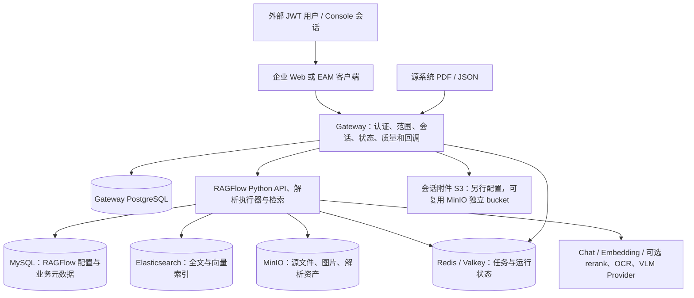

# TYrag 架构、性能、独立部署与持久化复核

复核日期：2026-09-12。源码基准为 HEAD `bce11900` 加当前未提交工作区；其中档位访问控制、显式 reasoning=0、正文流式回调和工具回退都有未提交实现，不能仅凭 commit/tag 判定镜像包含它们。本轮不改业务代码、契约、数据库或部署，只修订文档。

## 1. 结论

**Gateway 企业控制层 + RAGFlow 解析/检索层的结构可以继续使用，不建议推倒重来。但目前不能称为“直接打包一个镜像，就能在任意新环境跑完整服务”。**

- 核心需要 RAGFlow、Gateway、Web 三个应用镜像，以及 MySQL、Elasticsearch、MinIO、Redis/Valkey、Gateway PostgreSQL 五个数据服务；完整 Web 体验还要启用 diagnostics profile。
- 持久化已有主体设计：五个数据服务均有 named volume，Gateway 有文件共享只读挂载和状态目录读写挂载。**镜像包不包含这些数据**，附件 S3 配置与备份恢复仍有缺口。
- 新环境存在确定的配置/脚本缺口：API_PROXY_SCHEME 没有完整缺省链、安装器未读取 release.env、附件 S3 必填项不在生产模板；镜像 COPY 还会纳入本地生成的 service_conf.yaml。
- 性能首要问题是授权候选重复扫描和 N+1 质量查询，其次是 Agentic 证据评分、固定检索参数和多阶段串行模型调用。未跑负载测试，不声称已量得某个 QPS 或延迟倍数。
- 文档 ACL 仍是同租户开放的联调策略。JWT/HMAC/Console 认证存在，不等于部门、密级、allow/deny group 的文档权限已经实现。

## 2. 对前次说明的纠正

| 前次说明或容易造成的理解 | 当前核实结果 | 处理 |
|---|---|---|
| simple 省略 reasoning，可能被旧开关带入 medium | Gateway 现在显式传 0；RAGFlow 请求值优先 | 已改指南与分流说明 |
| 对外统一五档 | 外部 JWT 仅 simple/medium/high；Console 五档 | 已标 low/ultra 为 Console 专用，拒绝发生在持久化前 |
| 每轮一定按设备硬收窄 | legacy_device 仍收窄；authorized_context 使用完整候选 G，设备只是软上下文 | 已改整体关系、配置表与 ingestion 说明 |
| metadata 过滤先于问题理解 | restrict 普通聊天强制重写后过滤；Agentic formalize 后过滤 | 已重画 simple 流程，补 Agentic 过滤节点 |
| rag 总是累计完成才返回，所以不能流出正文 | 当前设置 stream_callback，将正文送 rag_stream 队列；无回调才返回累计字符串 | 已删除旧的统一缓冲判断 |
| 空结果会沿工具优先列表越过允许集合回退 | 最新 execute_with_fallback 校验本阶段允许集合，只容许兼容 hybrid→BM25 一次回退 | 已删除旧缺陷；本轮中代码继续变化，按最新文件复核 |
| 简单路径有 SQL，就代表 Gateway v2 可直接查结构化业务库 | 普通 SQL 分支要求非 grounding；v2 固定 grounding_version=1；更不是 EAM 实时 SQL | 已从 v2 主流程移除 |
| JsonParser 的 512 就是严格 512 tokens | JsonParser 先按序列化字符数分组，传入上限内部乘 2，naive 后续还有合并 | 已将 JSON 参数改为配置起点，不能保证严格块长 |
| 有 ACL 字段/最终范围过滤，就已具备生产细粒度授权 | evaluate_document_acl 当前只检查主体、租户和 active | 已明确实现边界 |
| 上轮 Mermaid/链接检查可证明流程描述正确 | 只能证明文档结构；必须沿当前调用链逐项审查 | 本次分别记录源码、纯函数与部署验证证据 |

仍成立的旧结论：Agentic 基础 hybrid_search 未继承聊天 top_n/top_k/阈值/rerank；最终图没有收到完整聊天 gen_conf 和自定义 system；REPLAN 的反馈仍未被 planner 消费。这些应作为后续设计修正，不应描述成已完成能力。

来源：[v2_router](../enterprise/gateway/query/v2_router.py#L563)、[dialog_service](../ragflow/api/db/services/dialog_service.py#L157)、[RAGTools](../ragflow/rag/advanced_rag/agentic_rag.py#L740)、[工具执行](../ragflow/rag/advanced_rag/harness/agent.py#L489)、[ADR-018](../decisions/ADR-018-Gateway-A授权与Metadata-Restrict.md)。

## 3. 当前结构与合理边界



应保留的设计：外部系统提供权威身份/源版本；Gateway 管企业接口、准入和生命周期；RAGFlow 管解析、索引和模型调用；检索前形成硬范围，最终过滤作第二道校验。Gateway PG 与 RAGFlow MySQL 分工不同，没有证据支持为了统一数据库而改上游模型。当前表队列/outbox 已有 claim/重试基础，也没有必要先引入 Kafka。

不合理或需要收敛的设计：

1. **将设备焦点混同授权。** authorized_context 的方向正确，但 G 的安全性取决于真正的 ACL；不能用 LLM metadata 过滤弥补尚未实现的文档权限。
2. **把“档位更高”同时定义成深度、准确率、工具数量和速度。** 当前档位阈值、融合规则、工具和参数都不同，应分别展示研究策略、成本预算与证据覆盖，而不是承诺单调质量提升。
3. **同一个聊天设置在两条路径有不同含义却没有明确提示。** 应明确哪些只管普通聊天；公共的模型/检索配置由已有 RAGTools 参数集中承接即可，无需增加一套配置平台。
4. **把 Console 当普通用户权限面。** 本地 Console 固定运营身份和全能力适合受控管理员，不适合作为全公司多人身份/文档授权替代。
5. **把上游大仓库所有可选能力都定义为“完整服务”。** 当前交付应先明确 Python 企业问答链路；Go/hybrid、外部 OCR、联网、沙箱等是按需能力。不能只因目录或端口存在就承诺镜像可用。
6. **默认多做改写/自动条件生成。** restrict 为正确性强制问题重写有理由，但连一条自包含问题也增加 LLM 调用。先保留安全语义，再以固定条件/已有明确上下文的短路减少调用；不能跳过授权和空集保护来省时。

## 4. 当前问题与优化优先级

P1 表示独立部署或生产接入前应处理；P2 表示影响规模、体验或可维护性，需按负载和业务目标处理。以下是代码审查结果，非实测性能排行。

### P1：生产授权能力与名称不匹配

[acl/policy.py:7](../enterprise/gateway/acl/policy.py#L7) 明确 `test-tenant-open-1`；同租户 active 文档允许，不消费 department/security_level/allow_group/deny_group。此策略没有因为 ENTERPRISE_TEST_MODE=0 自动变成细粒度权限。authorized_context 将这种同租户集合作为 G 时，不能用于要求部门隔离的场景。

建议：联调场景明确保留 tenant-open；生产前按已有 DocumentAclFacts 落实实际 deny/allow/密级规则及负例，或显式阻止需要细粒度权限的环境启用当前策略。不要拿设备识别或 metadata 条件充当 ACL。

### P1：新环境可能只启 Nginx，不启 Python API/执行器

[entrypoint.sh:191](../ragflow/docker/entrypoint.sh#L191) 在 API_PROXY_SCHEME 未设时只复制 python Nginx 配置；后续 [285](../ragflow/docker/entrypoint.sh#L285)、[340](../ragflow/docker/entrypoint.sh#L340) 却要求变量明确等于 python/hybrid 才启动 API 和任务。生产 Compose、env 示例、当前 Dockerfile/base 源码均没有设置它。除非实际基础镜像或目标环境额外注入，否则默认链不闭合。

建议：脚本入口统一缺省 python，并在发行配置明确写出；用干净环境验证 9380、上传、解析、聊天。Go/hybrid 另验二进制和原生库，当前 checkout 的 bin/ragflow_server 不存在且应用 Dockerfile 没有编译它。

### P1：运行配置会进入镜像 COPY

[Dockerfile:95](../ragflow/Dockerfile#L95) 整目录 COPY conf；当前 conf/service_conf.yaml 确实存在（仅检查存在性，未读取内容），[.dockerignore](../ragflow/.dockerignore) 没有排除它。后续只覆盖 template，不能保证已生成的 service_conf.yaml 不进入镜像层。重启时重新生成文件也不会擦除镜像旧层。

建议：排除所有已生成运行配置与环境凭据文件，发行只纳入审查后的模板；补 enterprise 构建 context 的 .dockerignore，减少 web/node_modules、产物及本地配置进入上下文。实际配置内容未读取，因此本报告不声称已发现具体凭据泄漏，但不应按现状直接发布该构建输入。

### P1：生产模板的附件存储配置不完整

[transient_attachment.py:301](../enterprise/gateway/sync/transient_attachment.py#L301) 需要 S3_TRANSIENT_BUCKET 或 S3_BUCKET；[source_adapter.py:63](../enterprise/gateway/sync/source_adapter.py#L63) 独立读取 S3_ENDPOINT、S3_ACCESS_KEY、S3_SECRET_KEY。模板没有这些项；MINIO_* 不会自动映射。上传只 put_object，不负责创建 bucket。临时附件功能可能在其它服务健康时仍不可用。

建议：在部署模板列出这套对象存储配置与 bucket 初始化要求，复用现有 MinIO 的独立 bucket 即可；若选外部 S3，明确它的备份与清理归属。用一份非敏感附件验证上传、读取、过期清理与引用。

### P1：离线安装没有消费打包时生成的版本选择

[package-offline.ps1](../deploy/production/package-offline.ps1) 支持自定义镜像 tag 并写 release.env；[install-offline.sh](../deploy/production/install-offline.sh) 只读 .env，从未传入 release.env。自定义 tag 被 docker load 载入后，Compose 仍可能按旧 .env 找镜像，配合 --pull never 直接失败。打包脚本要求 clean worktree，当前有大量既有未提交改动，不能执行正式打包；不能绕过门禁把 HEAD 当成工作区版本。

建议：发行版本变量作为安装器明确输入，并核对清单中的镜像 ID/平台；完整 Web 包同时固定 IncludeDiagnostics 和 --diagnostics。镜像清单记录 sourceCommit 不等于证明三个镜像都由该源码构建，应使用可核实 revision 标识/发行构建记录。

### P1：正文日志脱敏未覆盖普通文件 handler

[agentic_rag_graph.py:233](../ragflow/rag/advanced_rag/agentic_rag_graph.py#L233) 在 INFO 写问题/关键词片段，其他 planner/research 日志也包含 claim 文本。[think_log.py](../ragflow/rag/advanced_rag/think_log.py) 的脱敏仅处理自己的转发 handler；[log_utils.py:40](../ragflow/common/log_utils.py#L40) 文件与控制台 handler 没有对应过滤。故“浏览器只看到安全阶段”不能推导“服务端日志无正文”。

建议：优先改日志调用为阶段名、长度、数量、耗时；保留异常类型而不附原始模型文本。先检查调用点，再补统一脱敏兜底，不能只关 Langfuse 或只过滤浏览器输出。

### P2：授权候选 N+1 查询且每轮重复计算

[FormalScopeResolver.resolve](../enterprise/gateway/query/formal_router.py#L463) 分页读取所有 ready 映射，对每份文档再查最新质量；[_available_context_scope](../enterprise/gateway/query/v2_router.py#L982) 又对每份候选执行 readiness（再次查质量并开独立事务）。准备消息与真正发起检索都调用此链。

生产质量开启、N 份候选均通过时，一次范围构建约为分页查询加 2N 次质量读取；新消息至少准备/执行两次，总体可到约 4N 次质量读取，不含其它请求开销。这是按代码调用次数推导，不是数据库实测。authorized_context 候选更多，会放大成本和 doc_ids 请求/快照体积。

建议：在同一查询中批量取得每个文档最新 quality 与 readiness 所需字段，再执行现有策略；SQL 先筛 tenant/source/current/active/ready。第二次授权核验的安全目的要保留，可使用同一批查询、权限/版本修订号缩小重复成本，不能直接用陈旧 allowlist 长期缓存。先测查询数、DB 时间、候选数和载荷大小，再决定是否添加索引或版本化缓存。

### P2：证据评分不等于事实正确，且有可复现误判

[sufficiency.py](../ragflow/rag/advanced_rag/harness/sufficiency.py) 把数字转 float 后用 str(num) 查原文；输入与证据都为“电压24 V”，实际比较“24.0”，本轮执行原函数得到 cross_check_passed=False。medium 还用 max(A,C)，命中即先标 claim 已验证，所以交叉检查失败也未必降低融合分数。

[decompose.py:50](../ragflow/rag/advanced_rag/harness/orchestrator/decompose.py#L50) 为各独立结果写从 0 开始的 evidence_ids，之后拿全局合并池按位置查；第二个 claim 的 0 可指向第一个 claim 证据。这是明确的索引错位路径。

建议：先使用稳定 chunk_id 或在合并时建立正确全局索引；保留数字字面量/单位进行规范化核对。再以人工样本决定融合策略。不要把这套分数命名成答案正确率，也不要再加一个 LLM 审核来掩盖确定性错误。

### P2：Agentic 配置不统一、重复研究收益不足

[rag_agent](../ragflow/api/db/services/dialog_service.py#L2876) 未将聊天 top_n/rerank/system/gen_conf 完整交给图；[hybrid_search](../ragflow/rag/advanced_rag/harness/tools/search.py) 仍独立默认 top_n=12、阈值 0.2、向量权重 0.3。[planner](../ragflow/rag/advanced_rag/harness/planner.py) 不读 orchestrator 写入的 feedback；medium CONTINUE 也可能再次请求同一问题并命中请求内缓存。

建议：先明确用户可见配置的适用范围，将确实应共用的参数传入已有 RAGTools；不用的模型不提前绑定。重新规划应实际消费缺口反馈，或在没有新查询/新证据时停止。不要以更高并发重复相同检索。

### P2：后台串行、超时与工作器投影容易误导

[OutboxWorker](../enterprise/gateway/sync/worker.py#L39) 默认每次 claim 1 个且顺序处理，再 sleep；[StatusReconciler](../enterprise/gateway/sync/worker.py#L108) 每轮最多读 100 个并逐个 HTTP 回读，一项异常可中断本轮。大量慢解析/review_required 项可能拖延后面的任务；是否发生饥饿取决于 updated_at 更新方式与具体数据，需测最长等待时间。

生产 Gateway 单 uvicorn worker 内并存多个后台任务；单进程并不等于 HTTP 串行，但盲加 workers 会复制后台调度与进程内状态。先将同步/回读改为有界并发和公平游标，利用已有 PG claim，不必先换消息中间件。

生产 RAGFLOW_TIMEOUT=120，而单 claim 研究超时为 180 秒、还存在多轮；流式阶段事件可能避免读超时，非流式和无输出阶段仍存在预算冲突。应统一总期限、上游 read timeout、取消传播和 UI 等待语义。entrypoint 的 WORKERS=1 会覆盖环境 WORKERS，只有 --workers 参数会改它；Console 读取环境镜像值不一定代表真实进程数，应按实际启动参数/进程计数显示。

### P2：健康检查与可复现构建不足

Gateway Docker healthcheck 执行 [health.py](../enterprise/gateway/health.py) 只访问 RAGFlow；不验证本机 FastAPI、PG、附件 S3、回调配置或模型。健康为绿不能作为完整服务验收。

RAGFlow 前端使用 npm install 而非 npm ci；基础镜像是 tag，Gateway 继承整个大 RAGFlow 镜像且另装运行依赖。优先冻结依赖/镜像平台和 revision、补启动 import 检查；精简 Gateway 基础镜像可排后，先避免构建和迁移不一致。当前运行配置挂载与镜像本体要分开验收。

## 5. 文件与数据是否挂载

下表来自生产 Compose 的真实静态展开；“持久化”不等于已经备份，也不证明运行容器实际挂载。Docker volume 在容器删除后可保留，但需要独立备份/迁移流程。[Docker 官方说明](https://docs.docker.com/engine/storage/volumes/)

| 数据/文件 | 服务内位置与保存方式 | 当前是否配置 | 迁移注意 |
|---|---|---|---|
| RAGFlow MySQL | mysql_data → /var/lib/mysql | 是，named volume | Chat/模型配置、文档元数据需随库备份 |
| 全文/向量索引 | es_data → /usr/share/elasticsearch/data | 是，named volume | 与文档/对象版本保持一致；优先引擎快照 |
| 源文件、裁剪图等 | minio_data → /data | 是，named volume | 原文和图片引用依赖对象；只迁数据库会丢引用 |
| Redis/Valkey 状态 | redis_data → /data | 是，named volume | Compose 未显式启用 AOF；卷不等于每次写入已持久化，确认 RDB/AOF 与恢复策略 |
| Gateway 会话、run、outbox、quality、runtime settings | gateway_postgres_data → /var/lib/postgresql/data | 是，named volume | 不是旧 SQLite state 目录；需 PG 一致性备份 |
| RAGFlow 日志 | ragflow_logs → /ragflow/logs | 是，named volume | 源码有轮转；仍需确保日志内容合规 |
| FILE_SHARE 原文 | 宿主配置目录 → /var/lib/tyrag/file-share:ro | 是，bind mount | 原始业务文件不在镜像；目标机必须有文件、只读权限与相同映射语义 |
| Gateway 状态/审计目录 | 宿主配置目录 → /var/lib/tyrag/state | 是，bind mount | UID/GID 10001 要可写；不能拿此目录代替 PG 备份 |
| 会话临时附件 | S3 兼容 bucket；记录在 PG | 有代码，模板配置不完整 | 可用同一 MinIO 的独立 bucket；若外部 S3，要单独管保留/恢复 |
| RAGFlow conf / 模型资源 | 镜像 COPY/基础镜像；运行 conf 重生成 | 生产无独立 conf/resource 卷 | 模板应进镜像，secret 应运行注入；后下载模型缓存要预置或另挂，不保证离线首次下载可用 |
| Web dist | 企业 Web 镜像内静态文件 | 无需数据卷 | 源码变更要重建镜像 |
| 临时目录 | Gateway /tmp、Web cache/run/tmp 等 tmpfs | 是，临时空间 | 重启丢失是设计；容量需适合上传/临时处理 |

Redis 的 RDB/AOF 提供不同持久化保证；当前只是有 /data 卷，不能直接下结论“任务绝不丢”。[Redis 持久化说明](https://redis.io/docs/latest/operate/oss_and_stack/management/persistence/)

开发编排额外挂载 ragflow/api、rag、deepdoc、common、agent、memory、conf、web/dist，以及 enterprise/contracts；因此重启可加载宿主源码。生产编排仅靠应用镜像，不挂业务源码，Python 修改必须重建。生产没有源码卷是合理的；不能把开发 bind mount 当成可迁移镜像验收。

## 6. 镜像与新环境交付判定

| 验证层级 | 本轮结论 |
|---|---|
| Dockerfile/Compose 是否存在 | 是，三套应用构建文件与八服务生产编排 |
| 是否能解析生产 Compose | 是，Docker Compose 静态展开成功；不读取实际 .env |
| 当前镜像是否成功构建 | 未验证：Docker Desktop Linux Engine 管道不可用 |
| 当前源码是否等同最近发布镜像 | 未证明：HEAD 外有语义改动；9/11 release-manifest 只是历史构建清单，不是当前运行证明 |
| 干净主机完整冷启动 | 未通过本轮验证，且存在第 4 节明确缺口 |
| 已有数据跨机恢复与重建后不丢 | 未执行恢复演练；已配置主要卷，但镜像归档不带数据 |
| 目标架构支持 | 应先限定并验证 Linux amd64；当前 entrypoint 硬编码 x86_64 库路径，Go 二进制/基础镜像平台也待查，不承诺 ARM 通用 |

标准构建顺序仍可复用：

```bash
: "${TYRAG_RELEASE_TAG:?set a fixed release tag first}"
docker build -f ragflow/Dockerfile -t "tyrag/ragflow:${TYRAG_RELEASE_TAG}" ragflow
docker build --build-context contracts=./contracts --build-arg "GATEWAY_BASE_IMAGE=tyrag/ragflow:${TYRAG_RELEASE_TAG}" -f enterprise/gateway/Dockerfile -t "tyrag/enterprise-gateway:${TYRAG_RELEASE_TAG}" enterprise
docker build -f enterprise/web/Dockerfile -t "tyrag/enterprise-web:${TYRAG_RELEASE_TAG}" enterprise/web
```

上述是补齐构建输入排除与配置缺口后的执行入口，本轮未执行。首次安装还需先完成 RAGFlow 管理员/租户、模型、dataset/chat 和 API 凭据初始化，再启 Gateway；配置文件必填变量不等于目标环境已存在这些对象。保留外部 EAM/JWKS/模型 Provider 的实际可达性前提，镜像本身不提供外部系统。

完整 Web 需要启用 diagnostics profile；不带 profile 的 up 不会启动该服务，符合 Compose 本身的行为，但当前“可选诊断 UI”命名已不准确，因为它承载 Console/Harness。[Compose profiles](https://docs.docker.com/compose/how-tos/profiles/)

建议的交付完成顺序：

1. 固定本次源码与镜像 revision，排除生成配置；明确 Python 后端、三应用镜像、五数据服务与外部依赖。
2. 修安装器 release.env、附件 S3/bucket、实际 workers 和 Web profile；保留默认 loopback 绑定的安全含义，需要局域网访问时显式配置入口。
3. 在新项目名/独立空卷下冷启动；分别验证 Web 登录、JSON/PDF 入库、解析、检索、三档 JWT 聊天、引用、临时附件、回调及租户负例。
4. 重建应用容器，验证 PG/MySQL/索引/对象不丢；再做跨机备份恢复，保持源文件与版本一致。
5. 最后进行真实脱敏语料与负载评测；不要先调高 Agentic 档位或 worker 数掩盖数据链问题。

不对现有 30 服务器做 recreate；30-release overlay 依赖服务器原 Compose，是升级覆盖层，不是新环境完整安装文件。

## 7. 验证记录与本次范围

已执行：

- 最终三份文档共 10 张 Mermaid 流程图、73 个本地链接（含代码行号范围检查）、1 个 JSON 配置示例，全部检查通过；UTF-8 与改动 whitespace 检查通过。

- 用 Windows Docker CLI 做 `compose --env-file NUL -f ... config --no-interpolate --no-env-resolution --format json`，退出 0，核对八个服务及全部卷；未展开真实凭据。
- `bash -n ragflow/docker/entrypoint.sh`、`bash -n deploy/production/install-offline.sh` 通过；这只证明语法。
- 直接 Python 执行已有 test_answer_split.py 中 14 个无 fixture 断言，全部通过；没有伪称跑过 pytest 全套。
- 执行从当前源码提取的 reasoning 分流函数：显式 0 覆盖旧 true、显式 3 进入 Agentic，断言通过。
- 执行当前 cross_check_claim，复现完全相同“电压24 V”因 24.0 字面比较被判未通过。
- 核对最新工具允许列表、流式回调与对应单元测试源码；未运行需要完整 RAGFlow 依赖的那些测试。

无法完成：本机 Docker 引擎不可用，WSL 原生 docker 也提示未启用集成；Python 环境缺 pytest/FastAPI/SQLAlchemy，仓库 venv 的 Linux 解释器不可用。本轮未安装依赖、启动 Docker、读取运行 .env、调用模型、构建镜像或访问客户数据。因此不宣称镜像构建、完整服务 E2E、吞吐或灾备验收通过。

本次修改 [聊天指南](rag-current-guide.md)、[ingestion 方案](rag-ingestion-pipeline.md)，新增本报告。主要业务代码、上游、公共契约、配置、锁文件、数据库与部署均未修改；不写回共享记忆。后续按第 4 节处理 P1，再按数据规模处理 P2。
