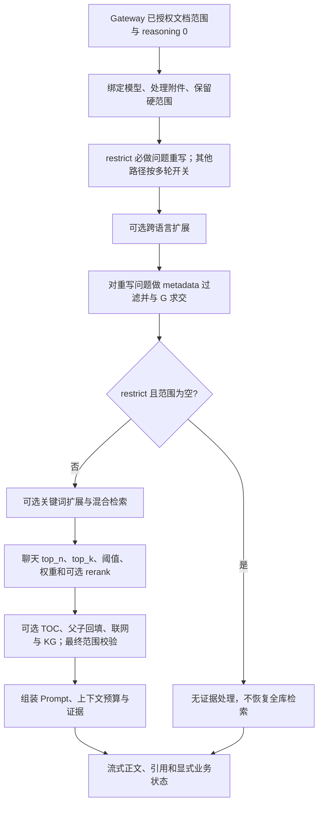
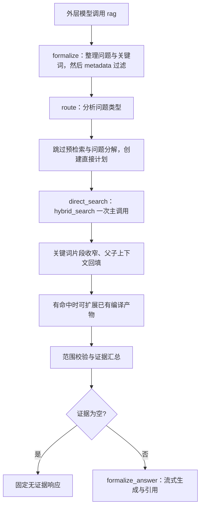
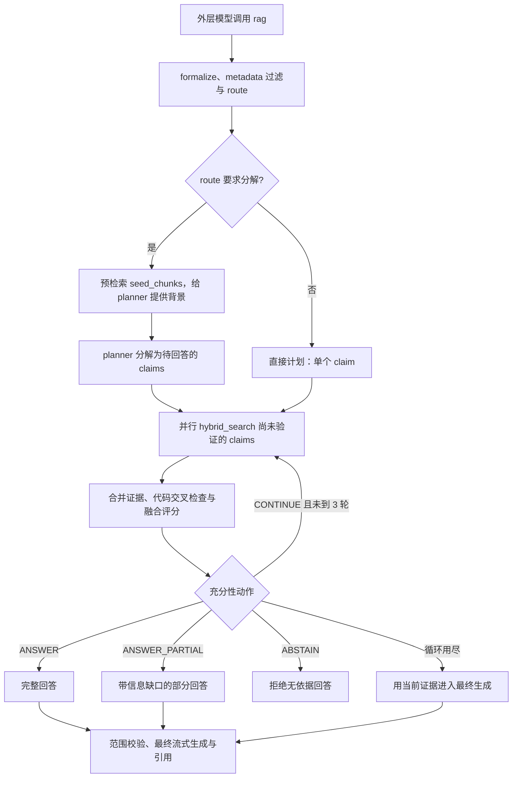
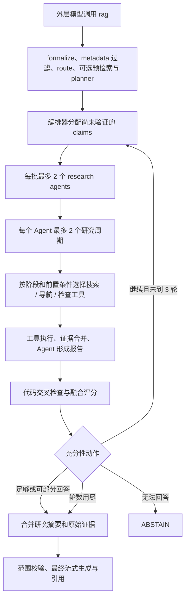
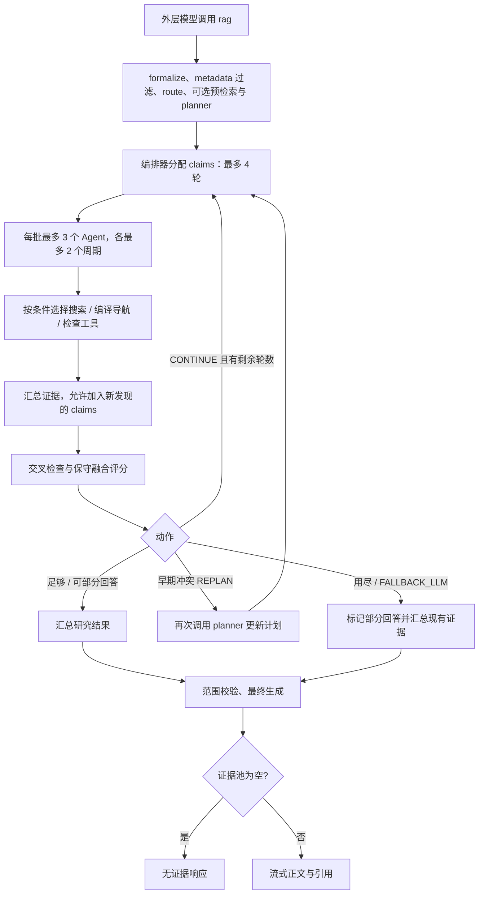
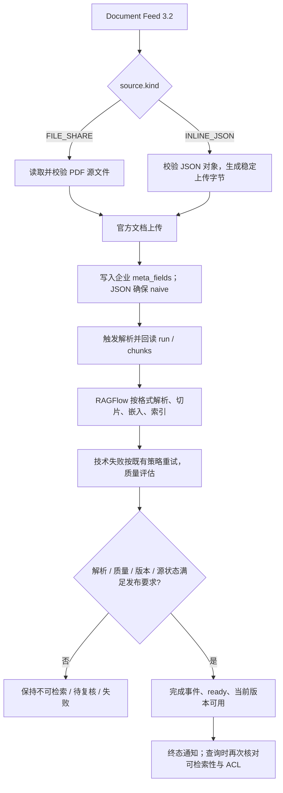

# 当前聊天推理、解析切片与 RAG 配置指南

核对日期：2026-09-12，基于 HEAD bce11900 及当前未提交实现。依据当前工作区源码（包含已有未提交改动），不是服务器运行配置快照。Query 契约为 `integration-openapi-v2.yaml` 2.9.0；Document Feed 为 `document-feed-v3.2.yaml` 3.2.0，兼容 FILE_SHARE 3.1.0。仓库以 RAGFlow v0.26.4 为基础，但已包含扩展，不能直接用网上同版本说明替代本地实现。

配套：[适配设备文档的 ingestion pipeline](rag-ingestion-pipeline.md)、[架构、性能、部署与持久化复核](rag-architecture-deployment-review.md)。本次纠正重点见复核报告第 2 节。

## 1. 先把整体关系串起来

入库阶段把文件变成可检索证据；聊天阶段按选定的授权范围策略找到证据，再组织回答。提高推理档位改变的是聊天检索与研究策略，不会重新 OCR、重切片或自动创建知识图谱。

| 项目组件 | 对应 RAG 概念 | 实际职责 |
|---|---|---|
| Gateway v3、sync、outbox | Ingestion control plane | 接收文档、重试、生命周期、版本和质量协调 |
| DeepDOC、JsonParser 等 | Document parsing / OCR | 从源文件提取内容与结构 |
| naive、table、picture、TokenChunker | Chunking | 决定证据单元大小与边界 |
| Embedding 模型 | Dense representation | 将问题和文本转成可比较的向量 |
| `settings.retriever`、文档引擎 | Hybrid retrieval | 词项匹配与向量相似度混合检索 |
| rerank 模型 | Reranking | 对候选证据再次排序；不是生成答案 |
| metadata、doc_scope | Filtered retrieval | 在检索前限定可用证据范围 |
| 父子切片、TOC | Context expansion / hierarchical retrieval | 小片段定位后补齐较完整上下文 |
| GraphRAG / 编译产物 | Graph / structured navigation | 利用预先建立的实体关系、目录、Wiki 导航 |
| LangGraph + harness | Agentic RAG | 分解问题、调用工具、检查证据、有限循环 |
| `kb_prompt`、上下文裁剪 | Context assembly | 将选中证据装入模型上下文预算 |
| Chat 模型与引用处理 | Grounded generation / attribution | 生成回答，关联证据与出处 |

这里的工具均为项目运行时的 Python 函数、模型 Provider 和检索服务；不是本次编写文档时使用的工具，也不表示已经连接外部 MCP 或生产数据库。

## 2. 五档共用入口与边界

Gateway 当前始终显式传 reasoning：simple=0、low=1、medium=2、high=3、ultra=4。RAGFlow 明确把请求值 0 当作普通聊天，不再被已保存的 prompt_config.reasoning 覆盖。只有原生调用省略 reasoning 时才使用聊天旧开关。外部 JWT 只允许 simple/medium/high，Console 会话允许五档；不允许的档位在附件或消息 run 持久化前返回 REASONING_MODE_NOT_ALLOWED。这不是模型 API 的 reasoning_effort，也不自动切换模型。

正式 v2 先形成候选集合 G，再持久化本轮 doc_ids 与策略快照。legacy_device（默认）继续按活动设备/明确设备线索收窄；authorized_context 使用全部通过 ACL、readiness 和质量门的候选，设备/型号/制造商只作为软上下文。后者传 doc_scope_mode=restrict，RAGFlow 先理解问题、后做 metadata 过滤，结果只能在 G 内；空集合不得恢复成全库。当前 ACL 实现仍为 test-tenant-open-1，同租户 active 即允许，不能将 G 宣称为已落实部门/密级/群组权限的生产授权集。引用为空与否仍不能决定 completed / no_reliable_evidence / failed。

Agentic 入口 rag_agent 先给外层模型绑定 rag 和 summarize_document。下述四张 Agentic 图描述调用 rag 后的主路径；明确的单文档摘要可以走 summarize_document。流式路径现在设置 stream_callback：RAGTools.rag 将图的正文 delta 实时发到 rag_stream 队列，工具自身返回空串，避免重复转述；没有回调的非流式路径仍累计为字符串。最终图或终止工具异常会向上抛出，Gateway 另拒绝未处理的工具协议残留，不能当成功回答保存。外层模型看到历史，图接收 rag(question) 构造的单条问题；formalize 整理问题后执行 metadata 过滤。

### 2.1 simple：常规混合检索

适合单点查事实、操作步骤和普通追问。`simple` 也可以启用 rerank、TOC、KG；“常规”不等于只做向量检索。没有进入下述研究 Agent 循环。原生普通聊天在 field_map 存在且非 grounding 时另有 SQL 分支；Gateway v2 固定 grounding_version=1，不能把该 SQL 分支画成正式 v2 的必经能力。

### 2.2 low：一次检索主调用（Console 专用）

不做 claim 分解，不做充分性评分，也没有研究 Agent 循环。一次 `hybrid_search` 主调用可能继续访问多个编译索引，所以不能理解成只有一次数据库请求或一次 LLM 调用。`formalize`、`route` 和最终生成都有模型工作。

### 2.3 medium：分解后并行检索

没有子研究 Agent，而是对 claims 使用 `asyncio.gather` 并行搜索；不能把配置中的 `max_parallel_agents=1` 当作这里的搜索并发上限。命中 chunk 时当前代码直接标记该 claim 已验证、置信度 0.8；这是实现启发式，不等同人工核实事实。

### 2.4 high：双层研究循环

适合跨章节、多证据核对。不会动态新增 claims，也不执行重新规划。每项 claim 的研究有 180 秒超时；这不是整条消息 180 秒总上限。图中的 2 个 Agent 周期是配置预算：文本回退路径有显式循环；原生工具模型只有适配器暴露 max_rounds 时才能由此设置内部循环上限。

### 2.5 ultra：允许扩展问题与重新规划（Console 专用）

`FALLBACK_LLM` 在当前实现中只是 `_finalize(...partial=True, fallback=True)`，最终节点依然检查证据池；不能解释成“没有资料也随意用模型常识回答”。高档位存在更多模型调用和检索分支，成本、延迟需实际测量。当前 REPLAN 分支会写 state.feedback 后重新调用 planner，但 planner 未消费 feedback；因此它是重新规划调用，不能宣传成已经根据冲突原因定向修正计划。

### 2.6 档位预算与充分性阈值

| 档位 | 编排器上限 | 单 Agent 周期 | 研究并发 | 充分 / 部分阈值 | 融合方式 |
|---|---:|---:|---:|---|---|
| simple | 不适用 | 不适用 | 不适用 | 无 harness 评分 | 常规检索生成 |
| low | 1 | 0 | 无研究 Agent | 0.85 / 0.50，直接路径不使用 | 不做充分性检查 |
| medium | 3 | 0 | claims 并行搜索 | 0.75 / 0.40 | max(A,C) |
| high | 3 | 2 | 2 | 0.65 / 0.30 | (A+C)/2 |
| ultra | 4 | 2 | 3 | 0.55 / 0.20 | min(A,C) |

A 是 AgentResult 已验证比例，C 是代码交叉检查通过比例；不是模型答对概率，也不是检索 similarity。当前交叉检查用数字和简单英文实体匹配，不是独立模型语义审校，对中文设备资料的准确性必须另行验收。阈值降低不能单独推导“ultra 更宽松”，它的融合方式也不同。

## 3. 聊天配置：在哪生效，改了会发生什么

界面、API 默认值、已保存聊天实例是不同层次；本次没有读取运行数据库或 `.env`，因此不声明当前服务实际选择的模型、开关值或检索阈值。

| 配置 | 对应概念及作用 | simple | low / medium / high / ultra |
|---|---|---|---|
| `reasoningMode` | 请求级检索编排策略 | 常规路径 | 映射到 1–4，选择 harness 模式 |
| `dataset_ids` / `kb_ids` | 知识来源 | 选择检索库 | 选择工具可见知识库 |
| `doc_ids`、本轮范围策略 | legacy_device 或 authorized_context 形成硬范围 | 检索过滤 | 工具过滤、metadata 交集、最终证据校验 |
| `meta_data_filter` | 按型号、类型等 metadata 过滤 | 在重写后执行；restrict 的 loader/pushdown/fallback 都受 G 限定 | 在 formalize 内对重写问题执行；restrict 空集立即保留为空 |
| `top_n` | 返回证据数量，增大可能增加噪声与上下文占用 | 传入 retriever | 基础 hybrid_search 默认 12，不继承聊天 top_n |
| `top_k` | 底层召回候选预算，不是最终引用数 | 传入 retriever 的 top | 基础 hybrid_search 未传聊天 top_k，使用底层默认 |
| `similarity_threshold` | 去掉低相关候选；过高易漏召回 | 聊天实例值 | 基础 hybrid_search 固定传 0.2 |
| `vector_similarity_weight` | 向量/词项信号混合；向量擅长语义，词项有利编号等精确文本 | 聊天实例值 | 有 embedding 时 0.3，否则 0 |
| `rerank_id` | 重排候选，提高顺序相关性，增加调用成本 | 传入检索器 | rag_agent 会绑定模型，但未将 rerank 传给基础 hybrid_search，不能视为已重排 |
| `prompt_config.keyword` | 查询关键词扩展 | 开启时调用关键词提取 | 不沿用此开关；formalize 自己生成关键词 |
| `refine_multiturn` | 将追问改写成独立检索问题 | restrict 必做，即使开关关或只有一轮；其他路径按多轮开关 | 外层模型读历史并传 question；图内 formalize 处理该单条问题，不沿用此开关 |
| `cross_languages` | 将查询扩展到指定语言 | 按配置执行 | 未看到沿用此配置的分支 |
| `toc_enhance` | 查询时按目录补上下文 | 按配置执行 | 由工具及编译产物处理，不直接照搬该开关 |
| `use_kg` | 查询时增加图谱证据 | 按配置执行 | 导航工具或 low 的编译扩展，需要相应产物 |
| `internetEnabled`、Provider | 外部网页检索 | 按实际联网控制与 Provider 补充网页；异常保留内部路径 | high/ultra 工具列表允许 web_search，且需 Provider 和工具阶段允许；low/medium 主策略只用 hybrid_search |
| `llm_id` | 回答、改写、规划所用 Chat 模型 | 生效 | 生效；本档位并不自动换模型 |
| `llm_setting.temperature` / `top_p` | 生成采样多样性；不是检索精度 | 传模型生成配置 | 外层模型使用；中间节点有自己的温度，不能保证全链路统一 |
| `max_tokens` | 模型输出预算，过小可能截断 | 模型适配器执行 | 同样存在节点自己的调用配置；最终图调用需单独核实传参 |
| `presence_penalty` / `frequency_penalty` | 降低重复，是否支持由 Provider 决定 | 模型生成参数 | 同上，不影响索引与 chunk |
| `system`、`parameters` | 提示模板与变量，`knowledge` 绑定知识 | 常规 Prompt 装配 | 当前 rag_agent 构造 RAGTools 未传 user_defined_prompts，最终使用 harness 模板，不能假设完整沿用自定义 system |
| `empty_response` | 空检索的预设回复 | 常规空结果处理使用 | 图节点存在固定英文无证据/拒答文本，不能假设沿用该文案 |
| `quote` | 提示与展示引用 | 常规引用配置 | 最终图有独立引用规则与引用池，不应等同同一开关 |
| `reference_metadata` | 引用中允许附带的 metadata | 按响应投影规则 | 仍需按实际响应核查；不会替代授权过滤 |
| `prologue`、名称、描述、图标 | 开场白与界面信息 | 展示用途 | 不改变检索算法 |
| `tts` | 语音输出 | 常规音频分支 | 不能仅因绑定了 tts 模型就宣称 Agentic 音频路径生效 |
| `stream` | 传输方式 | 流式 / 非流式 | 流式 / 非流式；不代表更深推理 |
| `grounding_version=1` | 企业接入的证据/输出保护约定 | Gateway 传递 | 同样传递，不负责决定推理档位 |
| 诊断开关 | 观测阶段耗时与计数 | 记录执行证据 | 记录执行证据，不提升召回质量 |

注意：当前 Agentic 最终生成的 `gen_conf` 缺省为 `temperature=0.3`；`RAGTools.rag` 调 `run_agentic_rag(self, messages)` 未传聊天的生成配置。不要把聊天 temperature/max_tokens 视为一定控制最终图回答的参数。界面的旧布尔 `prompt_config.reasoning` 仅在请求未显式传 reasoning 时决定分流，不能当作正式 v2 五档枚举。

临时附件走会话附件处理，并不因为在聊天框上传就自动成为永久设备知识库。消息回放需保留持久化状态；流式正文被最终结果替换时按 `answer.replaced` 处理。

## 4. 文档解析与切片配置

### 4.1 当前实际接入路径

`quality/routing.py` 内定义了 PDF → `naive + DeepDOC`、独立图片 → `picture`、表格文件 → `table` 的服务端 profile。分类依赖文件名、媒体类型、document_type，不是内容智能识别器。FILE_SHARE 的正式输入仍是 PDF，INLINE_JSON 是 JSON；路由函数支持图片/Excel 不代表 v3 接口已允许这些输入。

`sync_service.py` 当前主路径读取并协调 RAGFlow 文档状态，JSON 显式确保 `naive`。不能因为仓库存在 profile 定义，就宣称每个 Feed 文档当前都被统一强制应用了那三个 profile；应回读文档 `chunk_method/parser_config`。源版本、当前文档的已保存配置优先于界面缺省值。

### 4.2 参数作用表

| 设置 / 字段 | 对应概念 | 调整后的作用与代价 | 应用边界 |
|---|---|---|---|
| `chunk_method` / `parser_id` | 文档专用 chunker | naive 通用；manual/book/paper 按体裁；qa 按问答；table 按表结构；picture 针对图片；one 整文单块 | PDF 表格密集不等于改为 table；需重新解析 |
| `layout_recognize=DeepDOC` | 版面感知 OCR/解析 | 提取扫描文字、版面、表格和位置，较纯文本路线复杂 | 当前 PDF profile；具体已保存文档需回读 |
| PlainText / Naive 解析路线 | 原生文字提取 | 简单数字 PDF 可试，扫描/复杂表格会丢内容 | 与 chunk_method=naive 是不同维度 |
| MinerU / Docling / OpenDataLoader / 其他 OCR Provider | 外部或可选解析器 | 改善特定复杂版面有可能，需安装、模型/服务配置及评测 | 本地源码有适配，不表示已部署或自动回退 |
| `chunk_token_num` | Chunk size | 大块保留上下文但噪声多；小块更精确但可能拆开条件和结论 | 通用合并使用 token 预算，但 JsonParser 先按序列化字符数分组（内部 max_chunk_size 乘 2），不能承诺 JSON 每块严格 512 tokens；界面缺省 512，部分代码缺字段回退 128 |
| `delimiter` | 文本边界 | 优先以段落/标点形成片段，再按大小合并 | 不保证仅靠分隔符就能识别完整业务步骤 |
| `overlapped_percent` | Sliding overlap | 相邻块重复一部分内容以保护边界，增加索引和重复证据 | 当前 normalize 兼容 0–1 小数比例并限到 0–90；建议用明确整数百分数，如 10 |
| `children_delimiter` / `parent_child` | Parent-child retrieval | 用更细粒度片段检索，再返回父级上下文 | UI 会转换字段；naive 实际消费顶层 children_delimiter，不能只看 enable_children |
| `pages` | 解析页范围 | 只处理选定页，降低工作量 | 可能遗漏警告/索引/附录；需要明确记录范围 |
| `task_page_size` | 任务分批 | 每批处理页数，影响并发、内存及失败重试粒度 | 不是 chunk 大小，也不是语义章节长度 |
| `table_context_size` / `image_context_size` | 多模态上下文补充 | 将周围正文补到表/图附近，利于解释标题、单位、条件 | 需核实解析分支：当前 PDF 调用将 image_context_size 传入共同附加函数，不能承诺两者独立等效 |
| `image_table_context_window` | UI 中的图表窗口字段 | 表示界面配置意图 | 不能直接等同上述两个后端字段；需检查保存与任务 payload，不以名称猜单位 |
| `html4excel` | 表格表示 | Excel 可保留 HTML 表结构 | naive Excel 分支专用；不是 PDF 表格修复开关 |
| `auto_keywords` | Index enrichment | 每块让模型提取关键词，增强索引信号 | 0 关闭；增加入库调用，可能产生错误标签 |
| `auto_questions` | Synthetic query enrichment | 生成能由本块回答的问题以帮助检索 | 0 关闭；不是用户问答真值或证据 |
| `filename_embd_weight` | Title-aware embedding | 增加文件名对向量的影响 | 任务代码默认 0.1，并将假值回退 0.1，不能用 0 推断完全禁用 |
| Embedding 模型 | 向量索引表示 | 影响语言与领域召回 | 更换模型通常要重建向量，不能混用不同空间/维度 |
| metadata 提取配置 | Metadata enrichment | 提取类型、章节等属性 | `parser_config.metadata` 不等于已保存文档 `meta_fields`；设备身份由权威 metadata 提供 |
| `toc_extraction` | TOC index | 为长文构建目录证据，增加入库处理 | 查询侧 `toc_enhance` 才是使用目录的设置，两个阶段不能混淆 |
| `raptor.use_raptor` 及相关参数 | Hierarchical summarization | 聚类再摘要，增加层级概括；max_token 控摘要长度、max_cluster 控聚类规模、scope 控文件/库范围 | 摘要不是原文；设备 Scope 下跨文综合产物可能不满足来源约束 |
| `graphrag.use_graphrag`、实体类型、resolution/community | Graph construction | 抽实体关系、实体消歧及社区摘要 | 要先构建，再由查询工具消费；高档位不自动构建 |
| 编译模板：page_index/tree/wiki 等 | Knowledge compilation | 将原文预组织为导航或综合视图 | 独立产物与生命周期；布尔设置存在不保证产物已完成 |

修改解析器、chunk、父子规则及索引增强后，要对目标文档重新处理并回读证据；单纯改变聊天检索设置通常无需重切片。更新文档 `meta_fields` 与重新解析是不同操作，是否能安全只更新 metadata 应按接口字段区分。

## 5. 各档工具到底有哪些

| 工具 | RAG 概念 / 行为 | 配置允许的档位 | 真正可用的前置条件 |
|---|---|---|---|
| `hybrid_search` | 混合召回、关键词扩展/收窄、父子回填 | low、medium、high、ultra | 有可检索知识库与文档 |
| `bm25_search` | 词项检索 | ultra | 被当前阶段选中；适合编号/专有名词定位 |
| `web_search` | 外部检索 | high、ultra | 本轮允许联网，Provider 可用，阶段门控放行 |
| `structured_query` | 表格知识库 Text-to-SQL | ultra 配置列出 | 有 sql_kbs/field_map；正常阶段优先列表未列它，不能断言标准循环一定会绑定 |
| `ontology_navigate` | 实体/本体导航 | high、ultra | 编译产物、已路由 Scope |
| `dataset_navigation_by_tree` | 目录树导航 | high、ultra | 树产物及当前 claim |
| `graph_explore` | 沿实体关系扩展 | high、ultra | 有图产物且上下文已有 last_entity |
| `mindmap_navigate`、`wiki_query` | 思维导图/知识综合页导航 | ultra | 对应产物且阶段允许 |
| `inspector_open_context` | 打开证据上下文 | high、ultra | 已有证据块 |
| `inspector_compare` | 比较已有证据 | high、ultra | 已有证据且验证阶段可选 |
| `inspector_grep_within` | 在证据内匹配文本 | ultra | 已有证据且阶段允许 |
| `inspector_request_adjacent` | 扩展相邻上下文 | ultra | 已有证据且阶段允许 |
| `summarize_document` | 指定文档摘要 | Agentic 外层工具 | 明确文档 ID、Scope 允许；不等于任意全库总结 |

给模型绑定的工具经过 locate / explore / verify / cross_domain 阶段排序与数量限制。当前 execute_with_fallback 已校验本阶段 allowed_tools 与参数，只允许有授权的 hybrid_search 空结果再尝试一次 bm25_search，restrict 空范围不触发回退；不会再无条件沿阶段列表调用其他工具。low 的 `use_compiled=True` 可在混合检索后扩展已存在编译产物，也不能简单说“只有 ultra 会用知识图谱”。Text-to-SQL 面向 RAGFlow 结构化知识库，不能据此认定已连接 EAM 实时业务库。

研究 Agent 另有 think_tool（无检索副作用的控制步骤）与 generate_report（捕获结构化研究报告）；它们不是新的知识来源。原生 tool-calling 与不支持工具模型的文本回退都由 harness/agent.py 实现。初始 planner 的提示预算分别是 low 1、medium 3、high 5、ultra 8 个 claims；这不是代码强制截断上限，ultra 还允许动态增加。

## 6. 证据入口与尚未证明的事

| 说明范围 | 当前源码入口 |
|---|---|
| Gateway 映射与请求 | [v2_router.py](../enterprise/gateway/query/v2_router.py)、[Query 契约](../contracts/integration-openapi-v2.yaml) |
| 常规聊天、Agentic 外层、模型/Prompt | [dialog_service.py](../ragflow/api/db/services/dialog_service.py) |
| Agentic 六节点图、最终答案 | [agentic_rag_graph.py](../ragflow/rag/advanced_rag/agentic_rag_graph.py) |
| 工具实例与硬范围 | [agentic_rag.py](../ragflow/rag/advanced_rag/agentic_rag.py) |
| 五档参数 | [config.py](../ragflow/rag/advanced_rag/harness/config.py) |
| 执行策略 | [direct.py](../ragflow/rag/advanced_rag/harness/orchestrator/direct.py)、[decompose.py](../ragflow/rag/advanced_rag/harness/orchestrator/decompose.py)、[agentic.py](../ragflow/rag/advanced_rag/harness/orchestrator/agentic.py) |
| 评分与动作 | [sufficiency.py](../ragflow/rag/advanced_rag/harness/sufficiency.py) |
| 检索参数、编译扩展 | [search.py](../ragflow/rag/advanced_rag/harness/tools/search.py) |
| 工具门控 | [gating.py](../ragflow/rag/advanced_rag/harness/tools/gating.py) |
| 聊天 UI 字段 | [use-chat-setting-schema.tsx](../ragflow/web/src/pages/next-chats/chat/app-settings/use-chat-setting-schema.tsx) |
| 解析 UI 与字段转换 | [use-default-parser-values.ts](../ragflow/web/src/components/chunk-method-dialog/use-default-parser-values.ts)、[parser-config-utils.ts](../ragflow/web/src/hooks/parser-config-utils.ts) |
| 解析与增强 | [naive.py](../ragflow/rag/app/naive.py)、[task_executor.py](../ragflow/rag/svr/task_executor.py) |
| Feed 与质量 | [sync_service.py](../enterprise/gateway/sync/sync_service.py)、[routing.py](../enterprise/gateway/quality/routing.py)、[gate.py](../enterprise/gateway/quality/gate.py)、[readiness.py](../enterprise/gateway/sync/readiness.py) |

当前图文件头写着“4 nodes”，但 `build_agentic_graph` 实际注册六个节点；本文按执行代码绘图。medium/high/ultra 的效果表仍见 [reasoning-mode-eval.md](eval/reasoning-mode-eval.md) 中 pending live run，本次没有生成新的质量排名或延迟测试结果。

本次仅新增文档，不修改上游、契约、运行配置、数据库或部署。未读取客户文档正文或凭据。代码分支存在、UI 可见、配置已保存、线上实际执行，是四种不同证据，后续联调应分别核对。

2026-09-08 的 Mermaid/链接检查只证明当时文档结构有效，不证明当时所有源码解读正确。本轮验证范围与结果统一记录于 [复核报告](rag-architecture-deployment-review.md)，不作为真实业务 E2E 或部署验收。
