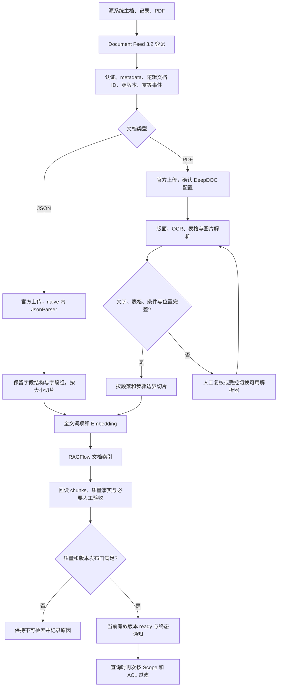
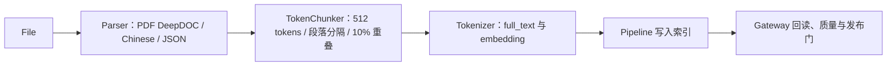

# 适配当前设备资料的 ingestion pipeline

日期：2026-09-12，按 HEAD bce11900 及当前工作区复核。本文是基于当前源码、接口及非敏感样本类型形成的配置与验收方案，不是已部署流水线。配套：[聊天五档流程与配置说明](rag-current-guide.md)、[部署与持久化复核](rag-architecture-deployment-review.md)。

## 1. 面向哪些内容

当前正式输入是 Document Feed 3.2 的 FILE_SHARE PDF 和 INLINE_JSON 对象。仓库有设备主档 JSON 对接示例，以及数字、扫描、混合、表格、图片/流程图 PDF 合成样本。这些证据支持下述分类，但不能证明实际客户语料比例或真实解析质量。

| 内容 | 典型问题 | 必须保留的证据单元 |
|---|---|---|
| 设备主档 JSON | 型号、厂家、参数是什么 | identity、technical_profile 等语义字段组，字段名与值、单位同在 |
| 维修、维保、点检记录 | 何时发生、采取什么措施 | 单条记录的日期、现象、动作、结果 |
| 说明书、操作规程 | 如何操作、什么情况下禁止 | 标题、完整步骤、前提、否定条件和警告 |
| 扫描/混合 PDF | 与原文件相同的问题 | 可校验 OCR 文本、原页和位置 |
| 参数、备件、检查表 | 哪个工况对应哪个值 | 表标题、表头、单位、行内容、脚注 |
| 流程图/示意图 | 分支如何走、部件在哪里 | 图片、标签、条件分支、标题和原页 |

设备身份以每份文档的可信 metadata 为准，不要求正文块都含设备号。legacy_device 按设备选择；authorized_context 中会话设备/型号只是软上下文，不能覆盖证据设备，也不能代替权限。当前 ACL 为同租户开放的联调策略，正式细粒度授权尚未落实。设备主档与每份附件保持各自逻辑文档 ID。

## 2. 推荐整体流程



图中内容完整性检查与人工切换解析器是建议执行的质量动作。当前路由不会自动理解复杂 PDF 后改走 MinerU/Docling。技术解析完成不等于业务资料已可用。

## 3. 先复用现有主链

现有 Gateway sync_service 已具备上传、写 metadata、启动解析、回读状态/可用 chunks、技术重试和版本质量协调。所核对主路径没有为每种文档显式选择 pipeline_id。第一步使用现有知识库与文档 parser_config 完成基础入库，不必重写同步器。

如果需要可视化编排，仓库已有原生 rag/flow 的 File、Parser、TokenChunker、Tokenizer，以及 Extractor、Compiler 和标题切片器。先在 RAGFlow 内配置少量样本，再验收 Gateway 对该流程终态、质量和版本的兼容。以下是可实施节点蓝图，不冒充已导入、已运行的 DSL。

### PDF 原生 Pipeline 蓝图



| 节点 | 首轮建议字段 | 验收点 |
|---|---|---|
| File | 原文件输入 | 文档与源版本可追溯 |
| Parser | setups.pdf.parse_method=deepdoc、lang=Chinese、output_format=json、suffix=[pdf] | 中英文、数字、单位、段落/表格和位置保留 |
| TokenChunker | delimiter_mode=token_size、chunk_token_size=512、delimiters=["\n"]、overlapped_percent=10 | 明确保存参数；512 只是对照起点 |
| 子片段 | 首轮 children_delimiters=[] | 基础内容正确后再试父子切片 |
| Tokenizer | search_method=[full_text, embedding]、fields=[text]、filename_embd_weight=0.1 | 全文与向量检索都可用，回读结果不为空 |
| 可选 Extractor / Compiler | 基础验收后单独增加 | 新增成本、召回收益和来源完整性可比较 |

传统配置用 chunk_token_num/delimiter/children_delimiter；可视化节点用 chunk_token_size/delimiters/children_delimiters，不能原样互抄。Embedding 使用有效模型配置，本文不指定未核验的模型名称或服务地址。

JSON 首轮继续使用已实现的 naive → JsonParser，不套 PDF Parser 配置。JsonParser 内部按序列化字符数分组并将传入大小乘 2，之后 naive 还有合并步骤；所以 512 是传入配置值，不能宣称每个 JSON 块严格 512 tokens。改为自定义 JSON Pipeline 时需另外验证输入输出与字段组保留。

## 4. 按文档类型给出配置起点

以下都是建议实验参数，不是现网默认或已证明的最优值。固定模型与检索配置，一次比较一个变化。

| 内容组 | 基线路线与大小 | 重点约束 | 何时调整 |
|---|---|---|---|
| 主档 JSON | naive/JsonParser，chunk_token_num=512 起点，重叠 0 | 短对象尽量完整，字段名、值、单位同块；关键词/问题生成先关 | 大对象召回不准时比较 256/512 或按已有字段组组织源 JSON，不硬截断键值 |
| 单条维修/点检记录 | 256–512 tokens，重叠 0 | 保留日期、现象、措施、结果；按逻辑记录组织 | 太长才按有意义小节分块，不把不同工单随机拼接 |
| 操作规程 | DeepDOC+naive，512 tokens，10% 重叠 | 段落分隔，步骤、前提和警告在同一可见上下文 | 跨块丢条件时试 768 或父子切片 |
| 长手册 | 同上 | 先保留原文基础块 | 章节定位差时试 TOC；上下文不足时试 768–1024 父块加段落子块 |
| 扫描/混合 PDF | DeepDOC+naive，512 tokens，10% 重叠 | OCR、阅读顺序、页码先通过 | 缺漏才对照已安装可用的 MinerU/Docling 等；改大小找不回 OCR 漏字 |
| PDF 参数/备件表 | 仍走 PDF DeepDOC | 表头、单位、行与脚注一起可见；超大表按保留表头的行组评估 | 错列漏单位先修解析/人工复核，不直接改 table 模板 |
| 图与流程图 PDF | DeepDOC，按已配置 VLM 能力补图描述 | 原页、标签、条件分支与否定条件完整 | 描述或 OCR 不全时视觉核验，不能自动发布成操作依据 |

父子切片的目标是小片段定位、较完整父块供回答；仅设置 token 数不保证章节边界正确。复杂标题结构才试 TitleChunker，并核对层次。

普通中文规程可以将以下传统 parser_config 字段作为首轮对照：

```json
{
  "layout_recognize": "DeepDOC",
  "chunk_token_num": 512,
  "delimiter": "\n",
  "overlapped_percent": 10,
  "auto_keywords": 0,
  "auto_questions": 0,
  "toc_extraction": false,
  "raptor": {"use_raptor": false},
  "graphrag": {"use_graphrag": false}
}
```

这是 PDF 建议字段片段，不是全量替换请求。保留已保存 metadata、页范围及其他必要配置，再回读最终有效值。JSON 用自身方案；已存在版本化 profile 不能直接改含义，应新增版本。

## 5. 增强能力何时值得打开

| 增强 | 什么问题才使用 | 本项目注意点 |
|---|---|---|
| TOC | 长手册问题定位不到对应章节 | 入库 toc_extraction 与 simple 查询 toc_enhance 是不同阶段 |
| 父子切片 | 小块命中却缺少条件或前后步骤 | 需要重解析与实际回填检查，不能只验证 UI 开关 |
| auto_keywords / auto_questions | 人工确认内容存在，但常见问法召回差 | 属于生成式索引增强，增加成本；生成词/问题不是证据 |
| RAPTOR | 长文概括问题确有需求 | 摘要可能丢细节，保留原文；优先文件范围，核验来源 |
| GraphRAG/编译图谱 | 部件、故障、措施关系需要跨段关联 | 先有产物再有导航；提高聊天档位不会构建图谱 |
| Wiki/跨文综合 | 有明确跨文综合收益 | 设备硬 Scope 下多来源产物可能被过滤，需完整来源链 |
| VLM | 图中标签/箭头/条件不能靠文字解析核验 | 图片描述只是辅助，原图与原页仍为核对依据 |

先解决基础解析与证据完整性，再考虑增强，避免用更多生成调用掩盖原文缺漏。

## 6. Metadata 与生命周期

复用现有契约：externalDocumentId 是稳定逻辑文档身份，sourceVersionId 表示内容版本，eventId 在同一次网络重试保持不变。主档和附件分别投喂，不能把同一设备的全部文件映射成一个覆盖更新的文档 ID。

已有 metadata 保存租户、设备、来源、文档类型、版本和状态。章节标题、表格标题、页码、语言可辅助定位，但新增字段应先核对严格 schema。source.content 的业务字段自由不等于顶层 metadata 可随意扩展。metadata 身份正确不证明 OCR 正文也正确。

全文检索保留设备编号、故障码和专有词精确信号，向量检索支持描述性问法。不要只留向量。更新 embedding 模型涉及向量空间/维度，需重建相应索引；不要混用不同模型向量。

当前 readiness 检查要求 current_version、active、sync ready、RAGFlow ID 齐全；受管理 Feed 还要求 pipeline DONE、event completed、source AVAILABLE 和质量通过，ACL 单独判断。RAGFlow DONE 或 chunks 非空不是完整发布证明。

临时聊天附件的字节在 S3 兼容对象存储，元数据在 Gateway PostgreSQL，不等于已存入永久知识库；生产模板目前没有完整列出 S3_ENDPOINT、凭据和附件 bucket，新环境需补齐，详见部署复核。

技术失败复用现有一次技术解析重试等机制；业务质量失败复核，不无限重试同一坏结果。新版本质量未通过时，验证旧有效版本继续可用；通过后再验证版本提升及重复回调幂等。

## 7. 质量门与验收

当前 gate 文本维度要求有效文本覆盖至少 0.9、乱码比例不超过 0.01；位置维度要求覆盖至少 0.9 且无越界页。必需能力声明缺失或未知时保守阻断。图像语义有图片时可为 not_evaluated，不能宣称已有自动视觉质量验收。

建议由业务方选择已获授权且脱敏的样本，每个核心类型 3–5 份，覆盖中英文混排、跨页表、扫描数字、否定条件与版本变更。先人工标注问题、原文页/字段组和关键条件，再跑解析。仓库 manifest 的 provenance 是 synthetic_generator、human_reviewed=false，只能用于工程回归。

| 验收项 | 必须观察的证据 | 决策方式 |
|---|---|---|
| 解析完整性 | 缺页、乱序、乱码、表格/图遗漏 | 关键页和操作条件无遗漏 |
| 关键字段 | 人工标注与实际提取值对照 | 编号、数值、单位必须正确 |
| 检索 | 预期文档/页/chunk 是否进入候选 | 按文档类型统计 Recall@k，不只看平均 |
| 回答 | 每条事实是否有证据支持 | 无编造编号、数值和操作条件 |
| 引用 | 点击后的原文与正文对应 | 不用引用数量证明正确 |
| 负向范围 | 设备 A/B、其他租户、旧版、停用、无答案问题 | 越权与错误版本命中必须为 0 |
| 成本/延迟 | 块数、解析耗时、模型调用、聊天耗时 | 按业务时延选择策略，不默认 ultra |
| 生命周期 | 重复投喂、新版失败与成功、重复回调 | 不重复建立逻辑知识，不发布失败版本 |

先固定 embedding、simple 检索设置，比较 512/10% 基线与一个候选方案。索引证据通过后再比较外部 JWT 的 simple/medium/high；low/ultra 使用 Console 或内部评测路径，避免混淆入库与推理效果。Recall@k 目标需结合标注和业务要求确定，本文不伪造效果百分比。

### 现有工具入口

| 工作 | 仓库工具 |
|---|---|
| 合成解析回归 | [generate_samples.py](../enterprise/scripts/wp03/generate_samples.py)、[sample_manifest.json](../enterprise/scripts/wp03/sample_manifest.json) |
| 解析评估 | [run_parsing_evaluation.py](../enterprise/scripts/wp03/run_parsing_evaluation.py)、[WP03 README](../enterprise/scripts/wp03/README.md) |
| 固定问题比较推理档位 | [eval_reasoning_modes.py](../enterprise/scripts/eval_reasoning_modes.py)、[reasoning_mode_cases.json](../enterprise/eval/reasoning_mode_cases.json) |
| 真实 HTTP 链路 | [run_file_share_v3_v2_e2e.py](../enterprise/scripts/run_file_share_v3_v2_e2e.py) |
| 原生 Pipeline 示例 | [general_pdf_all.json](../ragflow/rag/flow/tests/dsl_examples/general_pdf_all.json)、[title_chunker.json](../ragflow/rag/flow/tests/dsl_examples/title_chunker.json) |
| 节点参数源码 | [token_chunker.py](../ragflow/rag/flow/chunker/token_chunker.py)、[tokenizer.py](../ragflow/rag/flow/tokenizer/tokenizer.py) |
| 接入契约 | [document-feed-v3.2.yaml](../contracts/document-feed-v3.2.yaml)、[JSON 对接说明](integration/eam-json-feed-handoff-3.2.md) |
| 发布实现 | [sync_service.py](../enterprise/gateway/sync/sync_service.py)、[readiness.py](../enterprise/gateway/sync/readiness.py)、[gate.py](../enterprise/gateway/quality/gate.py) |

执行前使用各脚本 --help 核对当前参数。真实 HTTP 验收需要明确开发测试环境并安全注入凭据，本次未执行入库、未调用客户服务。不要为了验证本文重解析整库。

## 8. 实施顺序与当前交付边界

第一阶段：复用现有 Feed/质量链，少量 PDF 和 JSON 显式保存并回读基础配置，跑通真实业务问题与引用。第二阶段：只对失败类型加入 TOC、父子切片或替代解析器，一次改一项。第三阶段：确有跨章节/关联需求时再构建图谱或 Wiki，检查来源与设备 Scope。

本次交付是源码核实的流程、字段说明和适配方案，尚未将方案应用于实际知识库或完成真实语料调参。没有修改上游、运行配置、公共契约、数据库或部署。

官方概念参考：[原生 ingestion 核心组件](https://github.com/infiniflow/ragflow/blob/main/docs/guides/agent/ingestion_pipeline/understand_core_ingestion_pipeline_components.md)、[父子切片](https://github.com/infiniflow/ragflow/blob/main/docs/guides/dataset/configure_child_chunking_strategy.md)。官方 main 可能变化；本文配置字段以当前本地源码为准。
