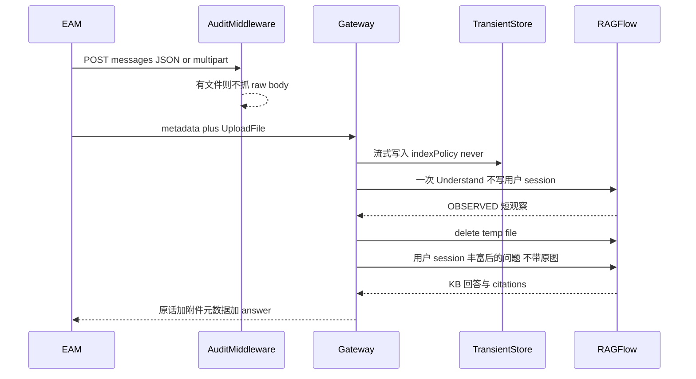

# 问询消息附件实现计划

> **For agentic workers:** REQUIRED SUB-SKILL: Use superpowers:subagent-driven-development (recommended) or superpowers:executing-plans to implement this plan task-by-task.

**Goal:** EAM 在现有 `POST /enterprise/api/v2/conversations/{id}/messages` 一次发送文字（可空）和文件；Gateway 落临时附件、先理解一次再检索；识别结果只做检索 enrichment，不能当权威证据。

**Architecture:** 无附件继续 JSON；有附件改为 `multipart/form-data` + `UploadFile`。Audit 不抓文件字节。视觉只跑一轮 Understand。RAGFlow 临时 file 用完即删。第一波只开放 jpeg/png/txt/pdf。

**Tech Stack:** Enterprise Gateway（FastAPI）、既有 TransientAttachmentService、RAGFlow v0.26.4 公开 Chat/Files API、`integration-openapi-v2` 2.3.0。

## Global Constraints

- 路径仍是 `/enterprise/api/v2`，不新开 v3 问询 URL。
- EAM 不先调 `POST .../attachments`；那条 JSON base64 只留给联调。
- 消息 JSON 不接收 `attachments[].content`。
- Gateway 不接视觉模型、不配第二套 API Key。
- 会话附件 `indexPolicy=never`，不进 Dataset / ES。
- 不修改 RAGFlow dialog 检索顺序。
- 第一波 MIME：`image/jpeg`、`image/png`、`text/plain`、`application/pdf`。
- 最多 5 个文件，单文件 10MB。

---

## 开工说明（AGENTS.md）

- **成功标准：** 纯文字 JSON 兼容；带附件一次 multipart 发送；只发照片也能问；检索能用图中短事实；引用仍来自知识库；识别结果不得写成已验证设备事实；Gateway 与 RAGFlow 均无长期残留文件；audit 不落文件字节。
- **将读取/修改：** `contracts/integration-openapi-v2.yaml`、`enterprise/gateway/query/`、`enterprise/gateway/feed_audit_middleware.py`、`enterprise/gateway/audit_log.py`、`enterprise/gateway/sync/transient_attachment.py`（复用 create + 扩展 cleanup）、`docs/integration/eam-inquiry-handoff.md`、`enterprise/tests/`。
- **契约版本：** `integration-openapi-v2` 2.2.0 → 2.3.0。
- **不修改：** RAGFlow 官方迁移、FILE_SHARE v3、auth/ACL、根锁文件。
- **验证：** `pytest enterprise/tests/test_v2_contract_static.py enterprise/tests/test_v2_conversation_contract.py enterprise/tests/test_transient_attachment.py enterprise/tests/test_audit_log.py enterprise/tests/test_v2_message_attachments.py -q`
- **主要风险：** 问询 audit 对 `/conversations/**` 无条件抓 body；RAGFlow 聊天 `files` 要自己的 file id；公开 OpenAI 路由忽略 `image_url`；VLM 幻觉不能被 grounding 洗白。

## 评审结论（相对第一版 JSON-base64 方案）

采纳：

- **P0 内存：** 消息附件不用 JSON base64。5×10MB 再乘 4/3，再叠加 Pydantic / `model_dump` / 多份拷贝，不适合 Python Gateway。有附件走 multipart + `UploadFile`（`SpooledTemporaryFile`）。
- **P0 审计泄漏：** `FeedRegisterAuditMiddleware` 对 `/enterprise/api/v2/conversations/**` 无条件 `capture_body`，前 64KB 进 audit；`_TEXT_KEYS` 含 `content`，只截断 2000 字符、不 redact。必须停抓 raw body，只记附件元数据。
- **幂等哈希：** `_request_hash` 改为 `question + fileName + mediaType + sha256(bytes)`，禁止 dump 整段文件。
- **只看图一次：** 正式 `chat_completion` 默认不再带原图。第一波不做「何时二次附原图」启发式。
- **OBSERVED ≠ 权威证据：** 视觉/OCR 只做检索 enrichment，不能当 KB citation，也不能写成「设备当前故障码是 E07」。
- **RAGFlow file 必须删：** `try/finally` + cleanup 清孤儿；E2E 验 RAGFlow 侧不残留。
- **第一波 MIME：** jpeg / png / txt / pdf。DOCX/XLSX/CSV/JSON 不做。

不按评审原文扩 scope：

- 不在本计划落地完整四档证据引擎；只把附件观察标成 `observed`，卡住不能洗白为权威证据。
- 不在 v1 做「问布局才二次附原图」。
- 不把 EAM 改回先上传再提问。
- 不改联调用 `POST .../attachments` 的 JSON base64。

## 产品与传输

EAM 对话框一次发送：只文字、文字+文件、只文件。EAM 不存文件。

- 无附件：`Content-Type: application/json`，现有 `{ clientMessageId, question }` 或 chips 不变。
- 有附件：同一 URL，`multipart/form-data`。
  - `metadata`：JSON `{ "clientMessageId", "question"? }`
  - `files`：原始字节，最多 5 个，单文件 10MB
- chips（`suggestionId`）禁止带文件。
- `question` 与 `files` 至少有一个。



## 文件职责

- `contracts/integration-openapi-v2.yaml`：双 Content-Type、第一波 MIME、413、历史元数据。
- `enterprise/gateway/query/v2_router.py`：按 Content-Type 分支；JSON/SSE 都走 Understand。
- `enterprise/gateway/query/v2_store.py`：`ext_v2_message.attachments_json`。
- `enterprise/gateway/query/attachment_context.py`（新建）：`AttachmentObservation`，trustLevel=`observed`。
- `enterprise/gateway/query/ragflow_client.py`：内部 upload / understand / delete file。
- `enterprise/gateway/feed_audit_middleware.py`、`enterprise/gateway/audit_log.py`：P0 不落文件字节。
- `enterprise/gateway/sync/transient_attachment.py`：流式 create；cleanup 删 RAGFlow 孤儿 file。
- `docs/integration/eam-inquiry-handoff.md`：EAM 改用 multipart。

---

### Task 1: 契约改为双 Content-Type

**Files:**

- Modify: `contracts/integration-openapi-v2.yaml`
- Modify: `enterprise/gateway/query/v2_router.py`（`CreateMessageRequest`、`_request_hash`、`create_message`）
- Modify: `enterprise/tests/test_v2_contract_static.py`
- Test: `enterprise/tests/test_v2_message_attachments.py`

- [ ] OpenAPI `info.version` 改为 `2.3.0`
- [ ] `POST .../messages` 声明 `application/json` 与 `multipart/form-data`（`metadata` + `files`）
- [ ] 第一波 MIME 仅 jpeg/png/txt/pdf；历史 `MessageAttachment` 含 `attachmentId/fileName/mediaType/sizeBytes/sha256`，不回字节
- [ ] 增加 `413`；chips 禁止带文件
- [ ] `_request_hash`：无附件 hash JSON 字段；有附件 hash `clientMessageId + question + sorted(fileName, mediaType, sha256)`
- [ ] 测试：旧 JSON 提问仍合法；multipart 只发 png 合法；消息 JSON 再塞 `attachments[].content` 拒绝；chips+files → 422；docx → 422

### Task 2: Audit P0

**Files:**

- Modify: `enterprise/gateway/feed_audit_middleware.py`
- Modify: `enterprise/gateway/audit_log.py`
- Test: `enterprise/tests/test_audit_log.py`、`enterprise/tests/test_v2_message_attachments.py`

- [ ] `POST .../messages` 且 multipart：`capture_body = False`；inquiry 前缀不再无条件抓包
- [ ] `_parse_body` 对名为 `content` 且像 base64/数据 URI 的值改为 `<redacted>`
- [ ] 成功后 inquiry audit 只记：`clientMessageId`、`hasAttachments`、`fileName`、`mediaType`、`sizeBytes`、`sha256` 前 12 位、`attachmentId`
- [ ] 测试：multipart 最小 png，audit JSONL 不得出现 `iVBORw0` 或 `%PDF`

### Task 3: 流式落临时附件

**Files:**

- Modify: `enterprise/gateway/query/v2_router.py`
- Modify: `enterprise/gateway/query/v2_store.py`
- Modify: `enterprise/gateway/sync/transient_attachment.py`（仅复用 `create`，读流时计数）

- [ ] `UploadFile` 流式读入，超 10MB 立即 413，不要先读完再测
- [ ] `_replay_or_pending` 之后、`reserve_message_run` 成功之后再 create
- [ ] 用户可见 `content` = 原始 question（可空）；标题原文优先，否则第一个 `fileName`
- [ ] `attachments_json` 存元数据；GET 不回字节、不嵌一次性 `downloadUrl`
- [ ] 开关关闭 → 503
- [ ] 测试：txt multipart 后 GET 文件名正确；`ext_document_map` 不新增；重放不新增 attachment 行

### Task 4: 一次 Understand + OBSERVED enrichment

**Files:**

- Create: `enterprise/gateway/query/attachment_context.py`
- Modify: `enterprise/gateway/query/v2_router.py`（`_execute_json_run`、`_stream_run_events`）

`AttachmentObservation`：

- `trustLevel`: 固定 `observed`
- `textSpans` / `errorCodes` / `equipmentCodes` / `visibleValues` / `confidence`
- `understood: bool`

- [ ] 图片：对 RAGFlow **一次** Understand，不传用户 `session_id`
- [ ] txt：Gateway 本地解码；pdf：只抽文本（扫描件无文本 = 未理解）
- [ ] 检索拼 OBSERVED 短码，并标明「上传附件观察，非设备台账」
- [ ] 正式生成默认不传原图 / RAGFlow file id
- [ ] 生成提示：必须写成「从你上传的图片中识别到疑似故障码 E07」，禁止「设备当前故障码是 E07」
- [ ] 观察不得进入 `citations`；`doc_ids` 不含 `attachmentId`
- [ ] 无文字且观察无效 → 业务失败；有文字但观察失败 → 用原话检索
- [ ] 测试：stub 返回 E07 时正式 question 含 E07 且 `files` 为空；GET 原文不变

### Task 5: RAGFlow 临时 file 生命周期

**Files:**

- Modify: `enterprise/gateway/query/ragflow_client.py`
- Modify: `enterprise/gateway/sync/transient_attachment.py`（`ragflow_file_id`、`ragflow_file_deleted_at`、`cleanup_expired`）

```python
try:
    file_id = upload(...)
    observation = understand(file_id)
finally:
    delete(file_id)  # 失败只记日志，留给 worker
```

- [ ] transient 记录保存 `ragflow_file_id` 与 `ragflow_file_deleted_at`
- [ ] `cleanup_expired` 对未删除的 ragflow file 再 DELETE `/api/v1/files`
- [ ] 正式问答路径默认不持有 RAGFlow file
- [ ] 测试：understand 结束后 `delete` 被调用；delete 失败时 cleanup 会再删一次

### Task 6: EAM 文档与回归

**Files:**

- Modify: `docs/integration/eam-inquiry-handoff.md`（v2.3）
- Modify: `enterprise/tests/fixtures/v2_contract_expectations.json`（若有 version 断言）

- [ ] 无附件 JSON 示例保持；有附件改为 multipart，明确不要 JSON base64
- [ ] 写明第一波四类 MIME、5 个、10MB；只发文件合法；chips 不带文件
- [ ] 说明识别结果是「疑似观察」，不是台账字段
- [ ] 回归：`test_v2_conversation_contract.py` 纯文字/chips/SSE/幂等全绿

## 明确不做

- 不给 EAM 新问询 URL
- 消息 JSON 不接收 `attachments[].content` base64
- Gateway 不接视觉模型
- 会话附件不进 Dataset / ES，不当 citation
- v1 正式生成不二次附原图
- v1 不接 DOCX/XLSX/CSV/JSON
- 不在本计划实现完整 grounding 引擎
