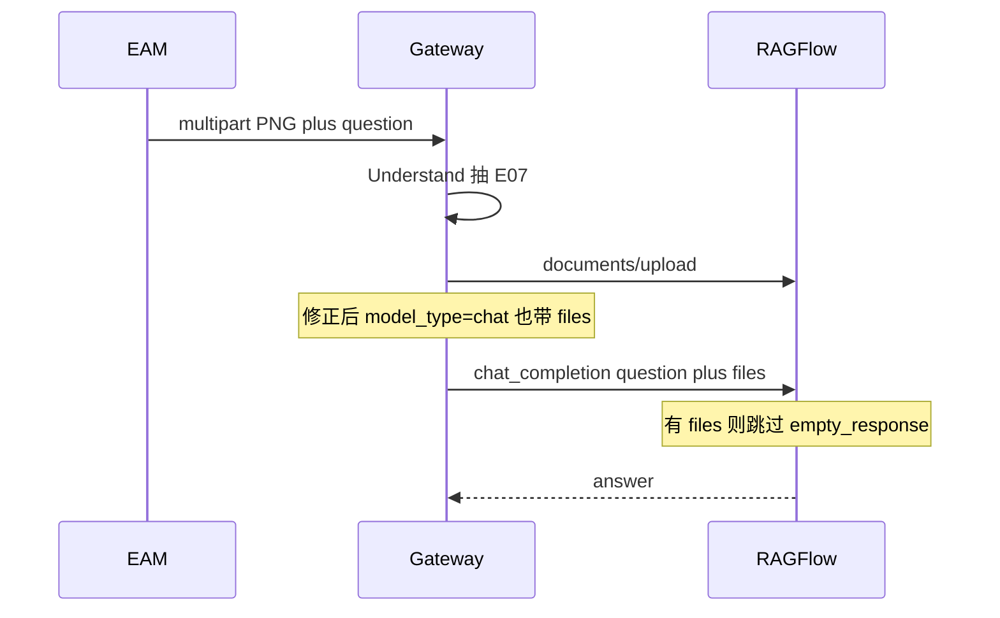

# 混合模式门闩修正 Implementation Plan

> **For agentic workers:** REQUIRED SUB-SKILL: Use superpowers:subagent-driven-development (recommended) or superpowers:executing-plans to implement this plan task-by-task. Steps use checkbox (`- [ ]`) syntax for tracking.

**Goal:** 修正混合模式门闩，使 RAGFlow `model_type=chat` 的企业对话也会把原图送进最终 `files[]`；与已有 `empty_response` 补丁一起部署。已有 Chat 的 v7 Prompt 由运维在 8080 上手改，Gateway 不自动 PATCH。

**Architecture:** 不新开功能面，只修门闩与联调缺口。Gateway 仍先做 Understand enrichment（question 含短码）；`chat`/`vision`/缺失 `model_type` 默认把图片放进 RAGFlow `files[]`；`empty_response` 继续按请求级豁免（有 `files` 则不提前 return）。维护边界保持薄混合：Gateway 只抽短码，正文/看图交给 RAGFlow。

**Tech Stack:** Enterprise Gateway（FastAPI）、RAGFlow v0.26.4 `dialog_service` / Chat API、`integration-openapi-v2` **2.6.0**（本轮不 bump）。

## Global Constraints

- 不新开功能面；只修 `chat_is_vision_capable` 门闩、文档口径、30 联调部署缺口。
- **不**在 `formal_router.py` 恢复对已有 Chat 的自动 `update_chat(prompt_config=...)`。
- 不修改 auth/ACL、投喂、OpenAPI 版本（仍 **2.6.0**）。
- 禁止在 Gateway 再做长 PDF/Office/扫描件解析器。
- Gateway + RAGFlow **必须同一窗口部署**；只更 Gateway、不更 RAGFlow 时，图就算进 `files[]`，KB=0 仍会被空响应短路。

---

## 开工说明（AGENTS.md）

- **成功标准：** 30 上 `enterprise-formal` 的 `llm_setting.model_type=chat` 时，EAM 发 PNG 的正式 `chat_completion` / SSE **带上** `files[]`；Gateway 仍先做 Understand enrichment（question 含 E07）；KB=0 且有 `files` 时 RAGFlow 不提前 `empty_response`；无附件 JSON/chips 不变；已有 Chat Prompt 不由 Gateway PATCH。
- **将读取/修改：** `enterprise/gateway/query/attachment_context.py`、`enterprise/tests/test_v2_message_attachments.py`、`docs/superpowers/plans/2026-08-18-inquiry-attachment-hybrid.md`（补正 Task 2b 对 `chat` 的错误假设）。
- **契约版本：** `integration-openapi-v2` **2.6.0** 不变。
- **不修改：** `enterprise/gateway/query/formal_router.py` 的「已有 Chat 不 PATCH Prompt」；auth/ACL；投喂；OpenAPI；本轮不改 EAM 协议。
- **已存在、本轮只部署：** `ragflow/api/db/services/dialog_service.py` 第 790 行 `and not messages[-1].get("files")`；`enterprise/gateway/query/enterprise_prompt.py` 的 v7 分叉（新建 Chat 已写入）。
- **验证：** `pytest enterprise/tests/test_v2_message_attachments.py enterprise/tests/test_v2_contract_static.py enterprise/tests/test_equipment_identity_prompt.py enterprise/tests/test_ragflow_chat_attachment_client.py -q --basetemp=c:\CodingProgram\WAES\TYrag\.pytest-tmp`
- **主要风险：** 纯文本 Chat 若误开会把图变成超长 base64；用 `ENTERPRISE_CHAT_PASS_IMAGES=0` 紧急关掉。已有 Chat 若未手改 v7，看图题仍可能被旧拒答句打成「无可靠依据」。必须 Gateway + RAGFlow **一起**发到 30。
- **维护边界（薄混合，已确认）：** Gateway 只抽短码做检索 enrichment；正文/看图交给 RAGFlow。禁止在 Gateway 再长 PDF/Office/扫描件解析器。升级税主要是 `dialog_service` 一行补丁，必须留在 CHANGE-REQUEST 里可重放。

## 长期维护结论

建议改成混合模式，而且必须保持薄。对照三种做法：

- **只保留 Gateway 先解析：** 代码少一条 `files[]` 和上游补丁，但「图里有什么 / KB=0」会持续误报，运维成本转到联调工单。
- **几乎全交给 RAGFlow（删 Understand）：** Gateway 更瘦，但检索 query 看不到图里的 E07，设备场景会回退。
- **薄混合（采用）：** Understand 只出故障码/铭牌等短观察；原件进 RAGFlow `files[]`；`empty_response` 一行按请求豁免。Gateway 不再增加 docx/xlsx/扫描 PDF 解析依赖。

长期要盯的只有三处，不要再膨胀：`chat_is_vision_capable` 默认跟官方 `chat` 看图对齐；`dialog_service` 补丁升级时重放；企业 Prompt 分叉（新建自动、已有手改）。MIME 新格式默认丢给 RAGFlow naive，Gateway 只放行类型。

## 背景（为什么现实现会挡图）

RAGFlow 自己看图的路径是 **`model_type == "chat"`**：

```348:349:ragflow/api/db/services/dialog_service.py
    if model_config["model_type"] == "chat" and image_attachments:
        convert_last_user_msg_to_multimodal(msg, image_attachments, factory)
```

30 上 `enterprise-formal-wp04e2e` 实测：`llm_setting.model_type = "chat"`。当前门闩只认 `vision` / `image2text` / `img2txt`，因此 `completion_files(..., vision=False)` 丢掉 PNG。原 Plan Task 2b 把 stub `chat` 当成纯文本，这个假设是错的。



---

### Task 1: 门闩与 RAGFlow 对齐

**Files:**

- Modify: `enterprise/gateway/query/attachment_context.py`（`chat_is_vision_capable`）
- Test: `enterprise/tests/test_v2_message_attachments.py`

改 `chat_is_vision_capable`：

- **默认放行图片：** `model_type` 缺失、为 `chat`、或为 `vision` / `image2text` / `img2txt` 时返回 True（与官方 `convert_last_user_msg_to_multimodal` 一致）。
- **紧急关闭：** `ENTERPRISE_CHAT_PASS_IMAGES=0`（或 `false`/`no`）时返回 False，图片退回 enrichment-only。不要用「llm_id 名字里有没有 vl」——30 上这条已经失败。
- `completion_files` 逻辑不变：非图的 docx/xlsx/txt/pdf 仍始终进 `files[]`。

测试（先改断言再改函数）：

- [ ] `model_type=chat` → `chat_is_vision_capable` True；PNG 最终 `files` **含** `image/png`；question 仍含 E07
- [ ] `model_type=vision` 仍含图
- [ ] `ENTERPRISE_CHAT_PASS_IMAGES=0` → PNG 不进最终 `files`（替代现在错误的「chat=纯文本」用例）
- [ ] 更新 `test_multipart_png_only_enriches_and_deletes_ragflow_file`：默认 stub 是 `chat`，应变为「enrich + 带 files」，生成后仍删除 temp file
- [ ] JSON/chips/docx/xlsx/幂等/审计回归保持绿

**验证：** `pytest enterprise/tests/test_v2_message_attachments.py -q --basetemp=c:\CodingProgram\WAES\TYrag\.pytest-tmp`

---

### Task 2: Prompt 只保证新建，已有 Chat 手改（ops）

**Files:** 文档为本任务主交付；**不**改 `formal_router.py`。

代码侧：

- **不**在 `_ensure_chat_info` 里恢复按 marker 自动 `update_chat(prompt_config=...)`。
- 新建 Chat 已走 `enterprise_prompt_config_for_api()`（v7），保持。

操作侧（部署后运维在 RAGFlow **8080** 做一次）：

1. 打开 `enterprise-formal-*` → Prompt 引擎 → 系统提示词。
2. 确认含 `enterprise_identity_metadata_v7` 和分叉句「附件观察与知识库事实必须分叉」。
3. 没有就从本地 `enterprise/gateway/query/enterprise_prompt.py` 的 `_ENTERPRISE_SYSTEM_PROMPT` 贴进去。
4. **不要清空 `empty_response`**（那条仍靠 RAGFlow `dialog_service.py` 一行补丁按请求豁免）。

- [ ] 文档写清上述 8080 手改 v7 口径（本文件；hybrid plan Task 3 短注）
- [ ] 确认 Gateway **不**自动 PATCH 已有 Chat

---

### Task 3: 文档补正（不改 EAM 协议）

**Files:**

- Modify: `docs/superpowers/plans/2026-08-18-inquiry-attachment-hybrid.md`（仅 Task 2b 错误假设）

- [ ] Task 2b 写明：`llm_setting.model_type=chat` 是官方看图路径（`convert_last_user_msg_to_multimodal` 当 `model_type == "chat"`），**不是**纯文本
- [ ] stub `chat` 应让 PNG 进入 `files[]`
- [ ] 紧急关闭是 `ENTERPRISE_CHAT_PASS_IMAGES=0`，不是「把 chat 当纯文本」
- [ ] 本轮不 bump OpenAPI（仍 **2.6.0**）

---

### Task 4: 30 联调部署（代码绿之后）

必须 **同一窗口** 更新：

- Gateway 镜像：含修正后的 `chat_is_vision_capable` / `v2_router` `files[]`。
- RAGFlow：含 `dialog_service.py` 的 `empty_response` + `files` 判断（30 上现在仍是旧 `if not knowledges and empty_response`）。
- 重启后抽查：list_chats 仍 `model_type=chat`；EAM 发一张 PNG，「图里有什么」且 KB 不必有命中，最终 completion 日志/stub 应有 `files`；8080 思考档位保持「简单」（Gateway 不传 `reasoning`，EAM 路径不受 8080 下拉框影响）。

只更 Gateway、不更 RAGFlow：图就算送进 `files[]`，KB=0 仍会被空响应短路。

- [ ] Gateway + RAGFlow 一起发到 30
- [ ] PNG `files[]` 与 `empty_response` 豁免实测

## 明确不做

- 恢复已有 Chat 的 Gateway 自动 PATCH Prompt
- bump OpenAPI（仍 2.6.0）
- 改 EAM 协议 / 新 URL / 新请求字段
- Gateway 全文解析 Office / 扫描 PDF OCR
- 只部署 Gateway 或只部署 RAGFlow
