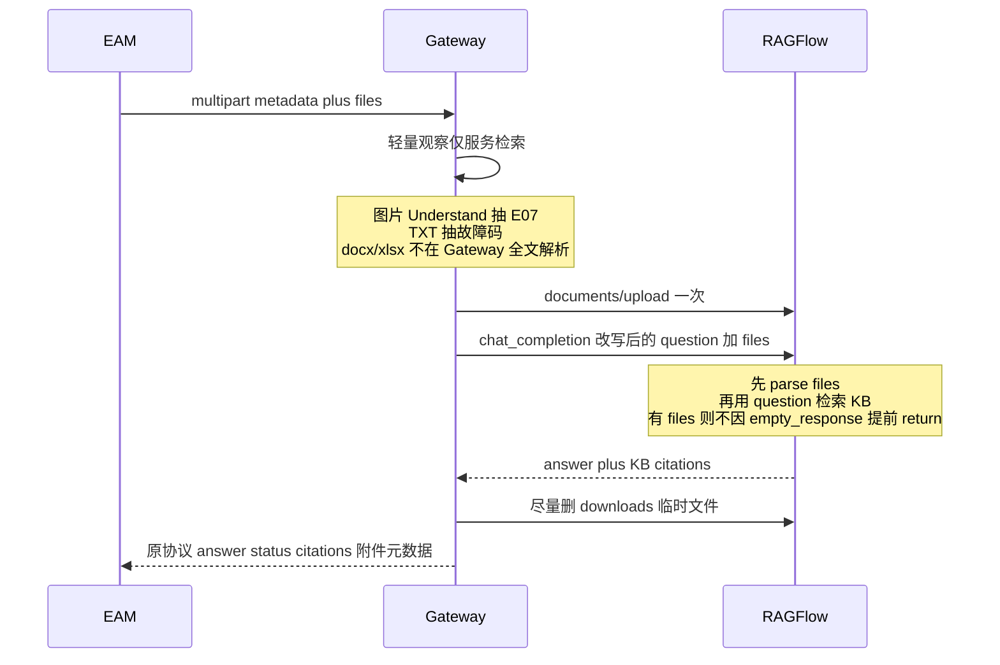

# 问询附件混合模式 + docx/xlsx 实现计划

> **For agentic workers:** REQUIRED SUB-SKILL: Use superpowers:subagent-driven-development (recommended) or superpowers:executing-plans to implement this plan task-by-task.

**Goal:** EAM 仍打同一条 `POST .../messages`；multipart 可传 jpeg/png/txt/pdf/**docx/xlsx**；原件进入 RAGFlow 最终 `chat_completion` **与 SSE stream** 的 `files[]`（仅当对话模型多模态才带图）；图片仍先抽短码做检索 enrichment；无附件 JSON/chips/`empty_response` 拒答不变；有附件时看图题允许 `已完成`+空 `citations`，维修/台账无 KB 仍拒答；`empty_response` 不 PATCH 共享 Chat；引用仍只来自知识库；audit 不落文件字节。

**Architecture:** 混合模式。原件经 RAGFlow `files[]` 进入最终多模态生成；Gateway 只保留轻量观察做检索 enrichment。`empty_response` 用请求级豁免（`messages[-1].files` 非空则不提前 return），不改共享 Chat 配置。

**Tech Stack:** Enterprise Gateway（FastAPI）、既有 TransientAttachmentService、RAGFlow v0.26.4 公开 Chat/Files API、`integration-openapi-v2` 2.6.0。

## Global Constraints

- 路径仍是 `/enterprise/api/v2`，不新开 v3 问询 URL。
- EAM 不先调 `POST .../attachments`；消息 JSON 不接收 `attachments[].content`。
- 最多 5 个文件，单文件 10MB；JWT、`metadata`+`files` 不变。
- 本轮 MIME：jpeg / png / txt / pdf / **docx / xlsx**。不接收 `.doc` / `.xls` / csv / ppt。
- FILE_SHARE v3 仍只有 PDF；投喂不增加 Office。
- 扫描 PDF 独立 OCR **本轮不做**；不把 PDF 页内图拆成多模态输入。
- 禁止本轮 `update_chat(prompt_config.empty_response="")`；不 PATCH 共享 Chat。
- 不改 `_business_status` 用 citations 反推状态。
- 不为续问自动重传上一轮原图（官方只读当前句 `files`）。
- Gateway 不引入 python-docx / openpyxl，不全文解析 Office。
- 不修改 RAGFlow 官方迁移、auth/ACL、根锁文件。

---

## 开工说明（AGENTS.md）

- **成功标准：** EAM 仍打同一条 `POST .../messages`；multipart 可传 jpeg/png/txt/pdf/**docx/xlsx**；原件进入 RAGFlow 最终 `chat_completion` **与 SSE stream** 的 `files[]`（仅当对话模型多模态才带图）；图片仍先抽短码做检索 enrichment；无附件 JSON/chips/`empty_response` 拒答不变；有附件时看图题允许 `已完成`+空 `citations`，维修/台账无 KB 仍拒答；`empty_response` 不 PATCH 共享 Chat；引用仍只来自知识库；audit 不落文件字节。
- **将读取/修改：** `contracts/integration-openapi-v2.yaml`、`enterprise/gateway/query/attachment_context.py`、`enterprise/gateway/query/v2_router.py`、`enterprise/gateway/query/ragflow_client.py`、`enterprise/gateway/query/enterprise_prompt.py`、`enterprise/gateway/sync/transient_attachment.py`、`docs/integration/eam-inquiry-attachment-notice.md`、`docs/integration/eam-inquiry-handoff.md`、`enterprise/tests/test_v2_message_attachments.py`、`enterprise/tests/test_v2_contract_static.py`。
- **契约版本：** `integration-openapi-v2` **2.5.0 → 2.6.0**（仅附件 MIME 加枚举；无新 URL、无新请求字段）。
- **不修改：** FILE_SHARE v3（仍只有 PDF）、auth/ACL、根锁文件、官方迁移。扫描 PDF 独立 OCR **本轮不做**。
- **验证：** `pytest enterprise/tests/test_v2_message_attachments.py enterprise/tests/test_v2_contract_static.py enterprise/tests/test_v2_conversation_contract.py enterprise/tests/test_enterprise_prompt.py enterprise/tests/test_ragflow_chat_attachment_client.py -q --basetemp=c:\CodingProgram\WAES\TYrag\.pytest-tmp`
- **主要风险：** 见下方「评审补充：新问题与功能影响」。共享 Chat 禁止 PATCH；扫描 PDF / PDF 内嵌图弱；downloads 桶孤儿文件；非多模态模型吃原图会爆 token；拒答句误杀看图题。

## 目标架构



职责：

- **Gateway：** EAM 契约、JWT、审计、生命周期账本、图片/TXT 短观察、retrieval enrichment、企业引用边界。
- **RAGFlow：** 原件消费（含 docx/xlsx naive 解析）、图片多模态、KB 检索、最终生成。
- **不做：** Gateway 引入 python-docx/openpyxl；扫描 PDF Dataset 级解析；动态改共享 Chat 的 `empty_response`。

---

### Task 1: 契约放开 docx/xlsx（EAM 可见）

**Files:**

- Modify: `contracts/integration-openapi-v2.yaml`
- Modify: `enterprise/gateway/query/attachment_context.py`（`MESSAGE_MEDIA_TYPES`）
- Modify: `docs/integration/eam-inquiry-attachment-notice.md`
- Modify: `docs/integration/eam-inquiry-handoff.md`（§4.2.1）
- Test: `enterprise/tests/test_v2_message_attachments.py`

- [ ] OpenAPI `info.version` → `2.6.0`
- [ ] `MessageAttachment.mediaType.enum` 与 messages POST 描述增加：
  - `application/vnd.openxmlformats-officedocument.wordprocessingml.document`
  - `application/vnd.openxmlformats-officedocument.spreadsheetml.sheet`
- [ ] 不接收 `.doc` / `.xls`。路径、JWT、`metadata`+`files`、5 个/10MB 不变。无新 URL、无新请求字段
- [ ] `MESSAGE_MEDIA_TYPES` 与契约同步
- [ ] EAM 文档：MIME 扩到 docx/xlsx；422 示例从 docx 改为 ppt / 旧版 .doc
- [ ] 测试：改 enum 断言；`test_docx_is_rejected` 改为接受 docx；新增 xlsx 200；新增 `.doc` 或 `application/vnd.ms-powerpoint` 仍 422

### Task 2: 原件进入最终 `files[]`（混合核心）

**Files:**

- Modify: `enterprise/gateway/query/v2_router.py`（正式 `chat_completion` 约 863 行、`chat_completion_stream` 约 987 行；`PendingAttachment`、`_execute_json_run`、`_stream_run_events`）
- Modify: `enterprise/gateway/query/ragflow_client.py`（`chat_completion_stream` 补上 `files`）
- Modify: `enterprise/gateway/sync/transient_attachment.py`（删除记账；能对 `{user}-downloads` 做 `STORAGE_IMPL.rm` 则补上）
- Test: `enterprise/tests/test_v2_message_attachments.py`

当前缺口：正式 `chat_completion` 和 `chat_completion_stream` **不传 `files`**；图片 Understand 后立刻当已删除。

- [ ] `PendingAttachment` 增加可选 `ragflow_file: dict | None`
- [ ] 每个待处理附件 **只 upload 一次**（已有 `upload_chat_file` → `/api/v1/documents/upload`）。幂等重放**不得**再 Understand / 再 upload
- [ ] 图片：仍 `understand_file(chat_id=None)` 抽观察；**不要在 Understand 后删**。最终是否带原图见 Task 2b
- [ ] TXT：Gateway 继续 `_from_text` 抽故障码（廉价，不引入新依赖）
- [ ] PDF：继续本机 `pypdf` 抽**文字层**做 enrichment。扫描件、页内嵌图见「评审补充」
- [ ] docx/xlsx：Gateway **不解析正文**；upload 成功即 `understood=True`，避免「只发文件 + 无文字」被 422
- [ ] `_execute_json_run` **与** `_stream_run_events` 必须传同一套 `files=[item.ragflow_file for item in pending if item.ragflow_file]`。漏 SSE 会导致流式仍看不见原件
- [ ] `chat_completion_stream` 补上 `files` 并写入 JSON body
- [ ] `try/finally`：生成结束后再 `delete_file` + `mark_ragflow_temp_file_deleted`。失败/超时同样记账本。`delete_file` 今天对 downloads 桶是空操作；能对 `{user}-downloads` 做 `STORAGE_IMPL.rm` 则补上，否则孤儿随 session 删除 + cleanup worker
- [ ] 测试：PNG 的 `question` 仍含 E07；多模态开启时最终 `files` 含 png descriptor；docx/xlsx 断言 `files[].mime_type` 正确且 **没有** 把整份 Office 正文拼进 `question`；SSE 路径同样带 `files`

### Task 2b: 多模态门闩（与 RAGFlow 官方 `chat` 看图对齐）

**Files:**

- Modify: `enterprise/gateway/query/v2_router.py`（最终 `files[]` 组装）
- Test: `enterprise/tests/test_v2_message_attachments.py`

`llm_setting.model_type=chat` 是 RAGFlow 官方看图路径（`convert_last_user_msg_to_multimodal` 在 `model_type == "chat"` 时触发），**不是**纯文本。30 上 `enterprise-formal-*` 即为 `chat`。把 stub `chat` 当纯文本会丢掉 PNG。

纯文本误传原图仍可能变成超长 base64（官方曾出现几十万 token）。紧急关闭用 `ENTERPRISE_CHAT_PASS_IMAGES=0`（或 `false`/`no`），不要把 `chat` 当纯文本挡图，也不要用「llm_id 名字里有没有 vl」。本轮不 bump OpenAPI（仍 **2.6.0**）。

- [ ] `model_type` 缺失、为 `chat`、或为 `vision` / `image2text` / `img2txt` 时，最终 completion 才带 **图片** `files[]`
- [ ] `ENTERPRISE_CHAT_PASS_IMAGES=0`：图片保持 enrichment-only；docx/xlsx/txt/pdf 仍可传 `files[]`（走文本解析，不依赖看图）
- [ ] 配置来源优先读已有 Chat 的 `llm_setting.model_type`，不要假设生产一定是 GPT-4o
- [ ] 测试：stub 为 `chat` 时 PNG 最终 `files` **含** `image/png`；stub 为 `vision` 时含图；`ENTERPRISE_CHAT_PASS_IMAGES=0` 时 PNG 不进最终 `files`

### Task 3: 请求级跳过 `empty_response` + prompt 分叉

**Files:**

- Modify: `ragflow/api/db/services/dialog_service.py`（约 790 行；独立 CHANGE-REQUEST）
- Create/Modify: `CHANGE-REQUEST.md`（说明原因、替代方案、兼容风险和回滚方式）
- Modify: `enterprise/gateway/query/enterprise_prompt.py`
- Test: `enterprise/tests/test_enterprise_prompt.py`、`enterprise/tests/test_v2_message_attachments.py`

共享 Chat 名是 `enterprise-formal-{tenant_id}`（`formal_router.py` `_ensure_chat`）。禁止本轮 `update_chat(prompt_config.empty_response="")`。Sibling Chat 会换 `dialog_id`，续问丢 `ragflow_session_id`。因此用 **上游最小补丁**（独立 CHANGE-REQUEST）：

```python
if not knowledges and prompt_config.get("empty_response") and not messages[-1].get("files"):
    ...
    return
```

有 `files` 时即使 KB=0 也继续进 LLM。无附件纯文字路径完全不变。

`enterprise_prompt.py` **必须分叉，不能只加半句「附件是观察」**。现有规则「Content 撑不住就必须写拒答句」会被 `force_abstain_outcome` 把看图题打成 `无可靠依据`。

- [ ] `dialog_service` 仅在 `messages[-1].files` 存在时跳过 `empty_response`；不 PATCH 共享 Chat
- [ ] 问附件里看见什么（故障码、铭牌、画面）：允许回答，标成观察，**禁止**因此写拒答句，**禁止** `[ID:n]`（除非同时引用了知识库片段）
- [ ] 问维修步骤 / 历史记录 / 制度：没有知识库 Content 仍必须拒答句；不得把附件观察写成台账事实
- [ ] 无附件时 `empty_response` 与现网一致
- [ ] Gateway `_business_status` 不改推导规则；靠 prompt + 既有 `force_abstain_outcome`
- [ ] 测试：看图题回答含「识别到疑似」且无拒答句 → `已完成` 且 `citations=[]`；维修题无 KB 仍含拒答句 → `无可靠依据`

**已有 Chat Prompt（ops，不自动 PATCH）：** 部署后在 RAGFlow **8080** 打开 `enterprise-formal-*` → Prompt 引擎 → 系统提示词。确认含 `enterprise_identity_metadata_v7` 和「附件观察与知识库事实必须分叉」；没有则从 `enterprise/gateway/query/enterprise_prompt.py` 的 `_ENTERPRISE_SYSTEM_PROMPT` 粘贴。**不要清空 `empty_response`**（仍靠 `dialog_service.py` 请求级豁免）。新建 Chat 已走 `enterprise_prompt_config_for_api()`（v7）。Gateway 不恢复 `_ensure_chat_info` 自动 PATCH。

### Task 4: 文档与回归

**Files:**

- Modify: `docs/integration/eam-inquiry-attachment-notice.md`
- Modify: `docs/integration/eam-inquiry-handoff.md`（§4.2.1；契约版本 2.6.0）
- Test: `enterprise/tests/test_v2_message_attachments.py`、`enterprise/tests/test_v2_conversation_contract.py`、`enterprise/tests/test_v2_contract_static.py`

EAM 文档除 MIME 外必须写清行为变化（协议字段不变）：

- `已完成` 可以没有 `citations`（只答附件观察时）
- PDF 内嵌图 / 扫描 PDF ≠ 直接发 JPG；续问默认**不会**自动带上一张图
- 带附件延迟可能增加（图片 Understand + 最终看图）；可能更多 `202`
- Gateway 不提供附件下载；RAGFlow downloads 会有短时副本

- [ ] 按上列四点更新 EAM 文档；422 示例从 docx 改为 ppt / 旧版 .doc
- [ ] 回归：无附件 JSON、chips、幂等（重放不再二次 upload）、413、审计 redact、`ext_transient_attachment` 仍为 0
- [ ] 验证命令跑绿（见开工说明）

## 评审补充：新问题与功能影响（实现前必读）

混合方案可以做，主要风险不在「会不会解析」，而在接地规则、状态口径、上下文和生命周期。

新问题：

- **状态变松：** 跳过 `empty_response` 后 KB=0 仍会生成。有正文就会 `已完成` + 可能空 `citations`。EAM 若把已完成当成「有知识库依据」会展示错。
- **拒答句误杀看图题：** 现有 prompt + `force_abstain_outcome` 见 Task 3，必须分叉。
- **图片看两次：** Understand + 最终多模态，延迟/费用/超时/`202` 上升，这是为了能答布局题。
- **非多模态爆 token：** 见 Task 2b。`chat` 是官方看图路径，不是纯文本；紧急关闭用 `ENTERPRISE_CHAT_PASS_IMAGES=0`，不要把 `chat` 当纯文本挡图。
- **大附件挤上下文：** RAGFlow 把解析正文拼进 system 再 `message_fit_in`；可能裁掉历史和 `{knowledge}`。图还是裁切之后才贴上。本轮不改 RAGFlow 裁切算法，文档说明 10MB×5 的上限风险。
- **附件只作用于当前句：** 官方只读 `messages[-1].files`。下一句纯文字问「黄图标」时原图不在；除非用户再贴，或依赖上一轮写进问题里的短观察。
- **downloads 桶：** 所有 EAM 用户经同一 RAGFlow API key 写入 `{api用户}-downloads`。公开 DELETE 删不掉；失败不删 session 会堆孤儿。
- **PDF 内嵌图不是 JPG 通路：** Chat naive 不把页内图拆成 `image_url`。联调易被当成 bug，文档必须写。

对现有功能（无附件应不变）：

- JSON 纯文字 / chips / 无附件 `empty_response` 拒答：必须回归绿。
- 引用过滤与 `downloadUrl`：字段不变；有附件时模型可能乱标 `[ID:n]`，靠 prompt 禁止用附件当知识库引用。
- `reasoning` / SSE：延迟变长；SSE 漏 `files` 会与 JSON 分裂。
- 续问与滚动摘要：大附件可能裁历史；图不自动带到下一轮。
- 幂等：重放不得二次 Understand/upload。
- 审计、Gateway 不写对象存储：不变；RAGFlow MinIO 会多临时对象。
- 投喂 HMAC / 知识库解析：不变。

实现必须钉死：

1. Prompt 分叉（Task 3），不是加半句观察口径。
2. 多模态门闩（Task 2b）。
3. SSE 与 JSON 同一套 `files[]`。
4. upload 一次，生成后（含失败）记删除；Understand 后不删。
5. EAM 文档写清已完成可无 citations、PDF≠JPG、续问不带上一张图。
6. `empty_response` 豁免仅 `messages[-1].files` 非空。

## 明确不做

- Gateway 全文解析 Office / 再造 parser
- 扫描 PDF / PDF 内嵌图 OCR 专项（不把页内图拆成多模态输入）
- 放开 csv/ppt/旧 .doc/.xls
- 投喂 v3 增加 Office
- 每轮修改共享 Chat 配置
- 改 `_business_status` 用 citations 反推状态
- 为续问自动重传上一轮原图（官方只读当前句 `files`）
