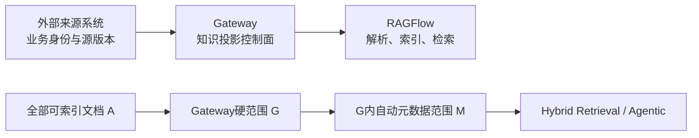

# Gateway→RAGFlow 知识投影版本与洋葱检索实施计划

> 状态：方案冻结，待 TYrag 实施
> 日期：2026-09-01
> 契约基线：Document Feed 3.2.0、Enterprise Inquiry API 2.9.0、terminal callback 1.0.0
> 实施范围：`C:\CodingProgram\WAES\TYrag`

## 目标

只建设知识库产品自身的两项能力：

1. Gateway 管理“当前可检索知识投影”，不接管来源系统的业务版本语义。
2. 问询严格执行 `A → G → M`：Gateway 先得到安全与业务范围 G，RAGFlow Automatic Metadata Filtering 只在 G 内继续得到 M，普通检索和 Agentic 均不得扩大范围。



## 职责边界

### 来源系统负责

- 提供稳定且不透明的 `externalDocumentId`。
- 提供来源系统自己的 `sourceVersionId`、业务状态和 upsert/disable/delete 意图。
- 决定哪些内容允许投影为知识，哪些事实仍由业务数据库权威提供。
- 对相同业务版本重试保持稳定身份。

### Gateway 负责

- 校验契约、tenant、ACL、Metadata、幂等和同版本内容冲突。
- 管理 processing round、重试、stale worker、质量门和终态 callback。
- 管理候选投影与当前可检索投影：新投影未准备好时继续提供旧投影，准备好后再切换并停旧。
- 保存并使用 `ragflow_dataset_id` / `ragflow_document_id`；正常启停不通过业务字段或 Metadata 反查。
- 查询时生成 G，并把 restrict 范围传给 RAGFlow。

### RAGFlow 负责

- 文档解析、Chunk、Embedding 和索引。
- 文档 enabled/disabled 物理状态。
- Automatic/Semi-auto/Manual Metadata Filtering。
- BM25、向量、Rerank、Agentic Retrieval 和引用。

Gateway 的 `current_version` 仅表示 `current retrievable projection`，不是来源系统的“当前业务版本”。Gateway 不解析 `externalDocumentId`，不维护业务单据类型目录，也不推断业务版本。

## 当前可复用基线

以下能力已存在，不作为新增平台建设：

- Document Feed 3.2 已支持 `FILE_SHARE | INLINE_JSON`。
- Gateway 已按 `(tenant_id, source_system, external_document_id, source_version_id)` 保存投影版本。
- `eventId` 幂等、同版本内容冲突、processing round 和 stale worker 防护已存在。
- 质量通过后启用新文档、事务晋升当前投影、旧投影标记 superseded、调用 RAGFlow 停旧文档的主链路已存在。
- Gateway 已生成 tenant、ACL、security、readiness 和实体 Scope 的 `doc_ids=G`，普通和推理档位均已传递该范围。
- Agentic 工具检索与最终 Chunk 已有 `doc_scope` 二次裁剪。
- RAGFlow Chat 已支持 Automatic、Semi-auto、Manual Metadata Filtering。

当前真实缺口：

- 新上传候选文档默认 enabled，质量通过前没有主动 disabled。
- 晋升后停旧只验证 batch API 响应，没有 GET/readback 确认新 enabled、旧 disabled。
- Metadata helper 对已有 `doc_ids` 使用并集：`G ∪ matched`；企业补丁再与 G 相交后恒等于 G，Automatic Metadata 没有从 G 收窄到 M。
- Automatic/Semi-auto 当前读取整个 Dataset 的 Metadata，不是仅 G 内 Metadata。

## 工作包 A：RAGFlow restrict 洋葱补丁

Gateway→RAGFlow completion 增加内部可选参数：

```json
{
  "doc_ids": "<Gateway G>",
  "doc_scope_mode": "restrict"
}
```

该字段不进入 Enterprise Inquiry v2 公共 API。未传 `restrict` 时保持 RAGFlow 官方默认行为。

restrict 模式固定行为：

1. 将 Gateway `doc_ids` 解析为硬范围 G。
2. Metadata loader 只加载 G 内文档的 Metadata；Automatic/Semi-auto 模型不得看到 G 外字段值。
3. ES/Infinity Metadata pushdown 同时附加 `doc_id IN G`。
4. Metadata 过滤返回 M，保证 `M ⊆ G`，不得把 G 与命中结果做并集。
5. 普通、流式和 Agentic Retrieval 均使用 M；所有工具和最终引用继续二次裁剪。
6. 未生成有效 Metadata 条件时 `M=G`。
7. 已生成有效条件但 G 内零匹配时使用显式空范围 sentinel，返回无可靠证据，禁止回退到 G 或 A。
8. 明确单文档模式且 `|G|=1` 时跳过 Metadata LLM，直接 `M=G`。

实现必须严格 gated，不能改变共享 `apply_meta_data_filter` 的官方默认并集语义。补丁按独立 ADR、CHANGE-REQUEST 和 `patches/manifest.yaml` 项维护。

诊断只记录：

```text
requestedDocumentIds = G
actualDocumentIds = M
metadataFilterMode
candidateCount / selectedCount
```

禁止记录问题正文、Prompt、Metadata 值和知识内容。

## 工作包 B：候选投影禁用与晋升 readback

先做真实 RAGFlow 契约验证：disabled 文档是否仍允许 `start_parsing`、完成解析并生成非空 Chunk。不得把该行为当作已知事实。

验证通过后：

1. 新候选上传并取得 RAGFlow document ID 后立即 disabled。
2. 候选在 disabled 状态完成解析和质量检查，不进入普通 RAGFlow 检索。
3. 质量不通过或 stale worker 晋升失败时保持 disabled，旧当前投影不变。
4. 质量通过时启用新文档，Gateway 事务晋升新投影并 supersede 旧投影，再按保存的 document ID 停用旧文档。
5. 通过 `list_documents` readback 验证新文档 enabled、旧文档 disabled；未收敛则作为可重试错误，不发送 `retrievable` callback。

若真实契约证明 disabled 文档不能解析，停止该工作包并提交替代设计；不得静默增加 staging Dataset、双写或其它平台结构。

## Metadata 原则

- 继续使用来源系统通过冻结契约提供、且由 Gateway 校验持久化的 Metadata。
- 保留已有 `equipment_id`、`fixed_asset_no`、`enterprise_document_type`、`enterprise_external_document_id` 等现有字段。
- 普通 INLINE_JSON 字段继续只作为文本/向量内容，不自动提升为 Metadata。
- 本计划不新增 `enterprise_business_type` / `enterprise_business_key` 等重复字段；只有真实检索证据证明现有字段不足时再单独提案。

## 测试与验收

### 聚焦测试

- `A ⊇ G ⊇ M`：多个实体共用 Dataset 时，Metadata 模型和 pushdown 均只能访问 G。
- Automatic 无条件时 `M=G`；有效条件命中时 `M⊂G`；有效条件零匹配时不扩大范围。
- 普通、流式、所有推理档位和 Agentic 工具均只检索 M。
- 未传 restrict 时 vanilla RAGFlow 行为不变。
- 单文档模式不调用 Metadata LLM。
- disabled 候选解析契约、质量失败保持旧当前投影、成功晋升、停旧 readback、重试和 stale worker 补偿。
- Metadata 不提升任意 JSON key。

### 真实 E2E

1. 来源系统投喂同一逻辑文档的两个版本。
2. 新版本处理期间旧投影继续可检索。
3. 晋升后 Gateway 显示新 `current_version=1`、旧 superseded；RAGFlow 显示新 enabled、旧 disabled。
4. 问询诊断显示 G 和 M；Automatic Metadata 只在 G 内生效，旧版本和范围外文档不进入引用。
5. 分开报告单元、契约、合成 E2E 和真实 E2E，不用本地测试代替真实验收。

## 明确不做

- 不修改 Document Feed 3.2、Inquiry v2.9.0 或 callback 公共 schema。
- 不实现任何 EAM、TPM、MES、ERP 的业务键生成和内容组装。
- 不解析业务键前缀，不维护业务单据类型目录。
- 不新增版本权重、Gateway 自建意图识别、业务专用检索接口或自定义 JSON Chunker。
- 不新增重复业务键 Metadata、staging Dataset、双写、数据库迁移或管理页面。
- 不部署到 `192.168.30.30`；部署与真实联调需另行明确授权。

## 执行顺序

1. 完成 restrict 补丁及 vanilla 回归。
2. 验证 disabled 文档解析契约；通过后再实施候选禁用和 readback。
3. 完成聚焦测试和本机真实 HTTP E2E。
4. 向外部来源系统只交付稳定契约、状态和 callback 证据，不交付 Gateway/RAGFlow 内部实现要求。

实施 Agent 必须保留无关工作区改动；完成报告列出修改文件、测试命令与结果、上游补丁、未解决风险和联调注意事项。
