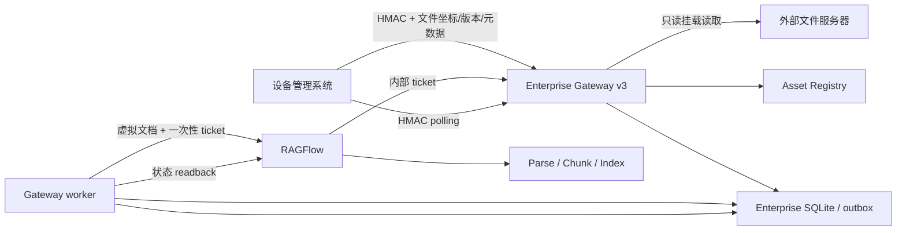
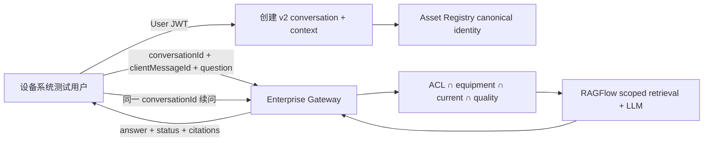

# 设备管理系统联调可运行版本实施计划

> 状态：本地设备联调基线已实施并通过；本文保留实施前分析和任务拆分，实施结果以第 0 节为准。
> 实施事实基线：以本文件所在提交及对应 `artifacts/enterprise-tests/` 验收记录为准；原始规划基线为 `ca3cd39d81131d70dac9061df94a63349cad81a1`。
> 契约基线：`contracts/integration-openapi-v2.yaml` v2.0.0、`contracts/external-integration-contract-freeze-v2.md`、`contracts/file-share-v3.yaml` v3.0.0、ADR-007。
> 目标：先建立可实际联调的测试环境，跑通设备管理系统经 Enterprise Gateway 完成文件入库和知识问答的两条主链；本阶段不扩展产品功能。

## 0. 实施结果与验收边界

截至 2026-08-11，本地测试开发环境已完成以下闭环：

| 计划步骤 | 结果 | 事实证据 |
|---|---|---|
| S0 契约事实收口 | 完成 | `file-share-v3.yaml` 已记录 v3 登记、状态列表/详情、HMAC、`statusUrl`、状态真实性和内部 ticket 边界；v2 OpenAPI 已记录 citation source/Range |
| S1 本地环境 | 完成 | RAGFlow、Gateway、Redis、FILE_SHARE root 和 HTTP Asset Registry Stub 的 Integration preflight 全部可用 |
| S2 测试身份/Postman | 完成 | HMAC integration identity、测试 User JWT、本地忽略 Environment、secret-free Collection/template 和 runbook 已提供 |
| S3 状态真实性 | 完成 | 状态响应返回 `pipelineStatus`、`parseCompleted`、`indexCompleted`、`qualityStatus`、`retrievable`、`errorCode`，且 `retrievable` 与正式 query 使用同源 readiness 判定 |
| S4 E2E-01 | 完成 | FILE_SHARE v3 登记、服务端 `statusUrl`、真实 ticket 取件、RAGFlow 解析/索引、质量门和限定文档 citation 已通过 |
| S5 E2E-02 | 完成 | 正式 v2 创建会话、两轮问询、历史、citation 详情和原 PDF source 已通过 |
| S6 负向基线 | 完成当前 P0 范围 | 离线门禁覆盖认证、绑定、重放、幂等、路径/文件变化、依赖失败、质量/ACL 和 SSE 失败；live Postman 覆盖重复登记、非法 HMAC、缺失源、未登记状态和非法 JWT |
| S7 本地验收/协议 | 完成 | Contract、P0 等价离线门禁、完整 Integration 和 Newman 均通过；正式设备对接协议已按最终实现生成 |

最近一次完整验收结果为：环境预检 7/7、Enterprise Python 535 passed、Web Vitest 123 passed、TypeScript 检查通过、FILE_SHARE v3 + formal v2 live E2E exit 0、Contract 22 passed；Newman 为 13 requests / 21 assertions / 0 failures。验收 artifact 只记录状态和非敏感证据，不包含 secret。

本结果的准确声明是“本地设备联调基线通过”。当前仍使用 Asset Registry Stub 和测试 JWT/HMAC，不代表客户正式 Asset Registry、SSO/JWKS、网络与真实文件服务器 Integration 已通过；M3 全量 Beta 也不因本地 P0 闭环自动晋级。

第 1 至 14 节保留原始实施依据。其中“当前尚未实现”“待实现”等表述描述的是原始规划基线；若与本节冲突，以本节、当前代码、冻结契约和同提交验收 artifact 为准。

## 1. 结论先行

### 1.1 本阶段唯一文件接入语义

新设备管理系统联调只采用已经由 ADR-007 采纳的 `FILE_SHARE v3`：

```text
设备管理系统已将 PDF 保存到外部文件服务器
→ 设备管理系统向 Enterprise Gateway 提交文件坐标、不可变版本、SHA-256 和业务元数据
→ Gateway 通过只读挂载定位文件并签发一次性短期票据
→ RAGFlow 解析任务通过 Gateway 内部票据读取临时文件
→ RAGFlow 解析、Chunk、建立索引
→ Gateway 复核 RAGFlow 状态、解析配置和质量门
→ 文档进入可检索状态
```

设备管理系统不向 Gateway 或 RAGFlow 直接上传 PDF 二进制，也不接触 RAGFlow 内部接口。`/enterprise/api/v2/documents` 的 S3/MinIO 坐标入口继续作为既有兼容能力保留，但不纳入本阶段的新设备联调、Postman Collection 或最终设备对接文档。不得为了方便测试改回 v1/S3 上传链路。

### 1.2 问询入口

设备用户问询只使用正式 `/enterprise/api/v2` 会话、消息和 citation 路由。`/enterprise/api/v1/demo/**` 仅是旧演示能力，不纳入本阶段验收。

### 1.3 Webhook 决策

本阶段不实施 Webhook。理由是文档登记本身返回 `202`，且已有文档状态查询路由，可以由设备管理系统轮询完成主流程；当前没有已确认的“必须由 TYrag 主动推送”的业务要求。

为使 `202 + polling` 成为可直接联调的完整协议，登记响应必须提供稳定的状态监控入口，设备管理系统不应自行拼接 URL。S0 优先冻结响应体中的 `statusUrl`（不含凭据的相对 URL，包含定位当前 tenant/source/document/version 所需的查询参数）；如同时返回 `Location`，其值必须与 `statusUrl` 指向同一资源。当前实现尚未返回这两个信息，因此这是待实现项，不是现状能力。

仓库中的 `enterprise/gateway/callback.py` 只是 transport-neutral 的 envelope、签名、幂等和重试策略对象，没有持久 delivery outbox、HTTP sender、sourceSystem endpoint 配置、投递记录或真实 receiver E2E，不能宣称 Webhook 已实现。若设备管理系统负责人确认必须主动通知，再将 Webhook 作为独立 P1 工作包冻结契约、实现和验收，不为使用 Webhook 而增加 Webhook。

### 1.4 当前验收判断

现有 P0/Contract/离线测试通过，不等于本计划目标已经完成。现有 Integration runner 的主要 E2E 仍使用 v1/S3 和 demo 问询；它即使补齐原来的 11 个环境变量并变绿，也不能单独证明 `FILE_SHARE v3 + 正式 v2 会话` 主链已经跑通。M3 Beta 仍保持未验收，直到本文定义的 E2E-01 和 E2E-02 在真实本地服务上通过。

## 2. 当前已经具备的能力

| 能力 | 当前事实 | 可否直接作为本阶段基础 |
|---|---|---:|
| FILE_SHARE 文件登记 | `POST /enterprise/api/v3/documents` 已实现 strict request、tenant/source binding、元数据校验、Asset Registry 解析、事件和版本幂等 | 是 |
| FILE_SHARE 状态查询 | `GET /enterprise/api/v3/documents/{externalDocumentId}/status` 和 `/sync-status` 已实现 | 是，但 v3 契约未完整记录 |
| 只读文件访问 | `ENTERPRISE_FILE_SHARE_ROOTS` 将稳定 root ID 映射到只读挂载；路径逃逸、文件大小和变化检查已实现 | 是 |
| RAGFlow 外部文件解析 | Gateway 可签发一次性票据；RAGFlow 已有可重放上游补丁注册虚拟文档，并优先读取 `external://` 临时源 | 是，需真实环境验证 |
| 异步处理 | Gateway lifespan 可启动 outbox worker、状态 reconciler 和 quality worker | 是 |
| 文档状态模型 | 已有 `received/registered/parsing/indexing/validating/ready/failed/...`、`businessStatus`、`currentVersion` | 部分；外部可检索语义仍需收口 |
| 正式会话 | v2 已实现创建、列表、详情、context 更新、归档和历史消息分页 | 是 |
| 正式问询 | v2 已实现 JSON 和真 SSE、`clientMessageId` 幂等、同会话续问、失败持久化 | 是 |
| 检索边界 | ACL、canonical equipment、active/current version、质量门在调用 RAGFlow 前求交 | 是 |
| Citation | 回答和历史保存外部文档 ID、版本、页码、bbox、excerpt；citation 详情和 FILE_SHARE Range source 路由已实现 | 是，但 source 路由缺正式契约记录 |
| 用户认证 | JWT issuer/audience/JWKS、测试环境显式 HS、用户映射和 capability 已实现 | 是 |
| 系统认证 | HMAC key identity、tenant/source pair binding、Redis replay、轮换和 fail-closed 已实现 | 是 |
| Asset Registry | HTTP adapter 已实现；本地开发 stub 文件存在，但不是正式 Integration 证据 | 测试环境可用，正式联调需替换真实服务 |
| Enterprise DB | Gateway 当前使用自己的 SQLite 保存映射、outbox、会话、citation 和质量状态 | 测试环境可用 |
| 部署 overlay | 当前 overlay 只提供 RAGFlow health probe，没有启动 Enterprise Gateway 或装配 FILE_SHARE mount | 否，需要补齐测试环境编排 |
| Webhook | 只有策略级工具和单元测试，OpenAPI 标记 planned | 否，本阶段不启用 |
| Postman | 当前没有 Collection | 否，需要交付 |

## 3. 当前缺口和必须修复的事实差异

### G-01：现有 live E2E 不是选定主链

`run_enterprise_tests.ps1 -Profile Integration` 当前要求 S3 变量，并执行 v1/S3 文档路径和 demo 问询。需要将设备联调验收改为 FILE_SHARE v3 登记、正式 v2 会话/消息；旧 S3 脚本保留为兼容回归，但不能代表本计划通过。

### G-02：v3 契约少于实际路由

`contracts/file-share-v3.yaml` 当前只记录登记和内部 ticket，未记录已存在的状态列表/详情、HMAC headers、完整响应和错误；当前 `202` 实现也没有返回 `statusUrl` 或 `Location`。应由 Lead 对现有行为做 additive 收口，不先设计新业务路由，并为登记响应增加稳定的状态监控链接。S0 以响应体 `statusUrl` 为必需字段；若附带 `Location`，两者必须一致。

### G-03：`ready` 与“用户可检索”仍可能被误解

代码在 RAGFlow `run=DONE`、parser readback 正确时把 `sync_status` 置为 `ready`，质量评估及 current-version promotion 另行执行；检索路径还会检查 active/current/quality。因此不能仅凭 `status=ready` 宣称用户一定可检索。

最小修复为在状态响应和契约中增加或明确以下事实字段，不伪造 RAGFlow 不提供的中间状态：

- `pipelineStatus`：RAGFlow 的真实运行状态；
- `parseCompleted`：parser readback 已验证；
- `indexCompleted`：RAGFlow 已报告 `DONE`；
- `qualityStatus`：质量门结果；
- `retrievable`：仅当 active、current version、parser verified、RAGFlow DONE、quality passed 且具备 RAGFlow IDs 时为 true；
- `errorCode`：失败时的稳定错误代码。

RAGFlow v0.26.4 公开状态不能可靠暴露“解析完成但索引尚未完成”的独立时刻。本阶段不修改上游核心来伪造这一时刻；对外以 `parseCompleted/indexCompleted/retrievable` 三个事实字段诚实表达。

在冻结这些字段前，Lead 必须再次以本文记录的固定 commit 为准，对照 `v3_router`、RAGFlow adapter/reconciler、parser readback、quality promotion 和 formal query gate 的实际代码与测试。不得仅依据本文假定现有行为，也不得只在响应层拼出几个 Boolean 就宣称完成。`retrievable` 应来自与查询准入同源的文档级判定；它表示文档已具备进入检索候选集的条件，不替代每个用户请求仍必须执行的 ACL 判定。

### G-04：没有 FILE_SHARE 真 E2E

现有 `test_external_file_source.py` 主要使用 Stub/ASGI 证明代码边界，没有证明真实 Gateway、真实 RAGFlow worker、真实解析、真实 Chunk、真实检索和真实 citation 的连续链路。

### G-05：测试身份还没有可交接的配置流程

已有认证机制，但没有针对本地设备联调的一键生成/注入说明。必须提供测试环境 HMAC 集成身份和 JWT 用户身份，且不能把 secret 写进仓库或 Postman 导出文件。

### G-06：Asset Registry 仍是临时边界

开发 stub 可以让本地主流程先跑通，但不能替代真实设备管理系统 Asset Registry 验收。stub 的 equipment-only 多固定资产语义仍待设备系统负责人确认。当前 stub 文档、脚本和测试还是工作树未跟踪文件；在完成代码审查并正式纳入仓库前，不能宣称干净 checkout 可复现。

### G-07：没有可直接使用的 Postman Collection

需要覆盖 HMAC 文件登记/状态、JWT 会话/问询/历史/citation，以及正常和错误示例。手工 Postman 联调优先使用 Postman Local Vault；自动化或无法使用 Vault 时，才使用未同步、未导出的本地 Environment。HMAC secret 和 JWT 均不得随 Collection 或 Environment template 导出。

### G-08：测试环境编排未包含 Gateway 主服务

`deploy/overlays/docker-compose.enterprise.yml` 当前只定义一次性 RAGFlow health probe，没有 Enterprise Gateway service、FILE_SHARE 只读挂载、Gateway/RAGFlow 双向网络和 external-source 环境变量。旧 E2E runner 会临时启动本机 Gateway，但不足以证明 RAGFlow 容器能通过内部 ticket 回读文件。需要补成可重复的测试 overlay 或等价启动脚本。

## 4. 接口复用、修改和新增清单

### 4.1 直接复用的公开接口

| 用途 | 接口 | 认证 |
|---|---|---|
| 登记 FILE_SHARE 文档 | `POST /enterprise/api/v3/documents` | HMAC integration identity |
| 查询单文档状态 | `GET /enterprise/api/v3/documents/{externalDocumentId}/status` | HMAC integration identity |
| 查询文档任务列表 | `GET /enterprise/api/v3/documents/sync-status` | HMAC integration identity |
| 创建会话 | `POST /enterprise/api/v2/conversations` | User JWT |
| 查询/恢复会话 | `GET /enterprise/api/v2/conversations`、`GET /conversations/{id}`、`GET /conversations/{id}/messages` | User JWT |
| 提交问题/同会话续问 | `POST /enterprise/api/v2/conversations/{id}/messages` | User JWT |
| Citation 详情 | `GET /enterprise/api/v2/citations/{citationId}` | User JWT |
| Citation 原文件定位 | `GET /enterprise/api/v2/citations/{citationId}/source` | User JWT |

`/enterprise/internal/source-tickets/{ticket}` 只允许 RAGFlow worker 使用，不属于设备管理系统公开接口。

### 4.2 需要修改的现有行为或材料

1. 补全 `file-share-v3.yaml` 的状态路由、HMAC 安全、响应和错误定义。
2. 为 `202` 增加稳定 `statusUrl`，并对状态响应补充 G-03 的真实可检索字段及契约/单元测试。
3. 让 `m1e_document_producer.py` 和运行说明明确支持以 `/enterprise/api/v3` 为 base URL 的 FILE_SHARE payload；不复制第二套签名实现。
4. 调整 Integration runner 的环境前置和 live suite：设备主链不再要求 S3，改为 FILE_SHARE root、RAGFlow external-source Gateway 配置和正式 v2 query。
5. 将 Asset Registry stub 作为明确的 development dependency 接入启动说明；正式验收报告必须标注使用 stub 还是客户真实 Registry。
6. 补齐 citation source 的正式外部契约和测试。
7. E2E 通过后更新 `docs/M1-M3-验收状态矩阵.md`；通过前不改成 accepted。

### 4.3 需要新增的交付物

- 一个 FILE_SHARE + formal v2 的 live E2E runner；
- 一个不包含 secret 的 Postman Collection 和 Environment template；
- 一个复用现有 HMAC/JWT 机制的测试身份准备脚本或操作说明；
- 每次运行独立的 JSON/JUnit/log 证据目录；
- E2E 全部通过后才生成《设备管理系统—企业知识库对接协议》。

本阶段原则上不新增公开业务路由。若实现中发现现有路由无法满足链路，必须先提交契约变更说明，再由 Lead 决定；不能由执行 Agent自行扩大 OpenAPI。

## 5. Authentication、Service Identity 和 User Token

### 5.1 文件链路：测试 Integration Identity

正式 v2/v3 文档接口不会接受 legacy Bearer Service Token；它们要求 HMAC。测试环境中的“Enterprise Token”应落到现有 `ENTERPRISE_SYNC_HMAC_CREDENTIALS` 机制，而不是新增一个绕过认证的静态 Token。

测试身份建议命名为 `device-integration-local`，只授权一个明确 binding：

```text
credentialId = device-integration-local
keyId        = local-device-key-1
allowedBinding = (测试 tenantId, 测试 sourceSystem)
status       = active
```

`secret` 由本地 secret 生成器产生，只注入 Gateway 进程和服务侧 producer；手工 Postman 优先从 Local Vault 读取，自动化回退到未同步、未导出的本地 Environment。不写入源码、payload、命令行、日志、artifact、导出文件或 Git。权限仅限这个 tenant/source pair 的文档登记、状态和生命周期；请求不能通过改变 body 扩大 binding。

Postman 使用 Collection pre-request script 根据 raw body、method、canonical path/query 和时间戳生成：

- `X-TY-Timestamp`；
- `X-TY-Key-Id`；
- `X-TY-Signature: v1=<hex>`。

同一个已签名请求不能重放；重复业务请求必须生成新 timestamp/signature，并依靠 `eventId` 和文档版本幂等。

### 5.2 问询链路：测试 User JWT

本地测试可显式使用 HS256，但只允许在测试 Gateway 进程中启用；生产仍使用客户 issuer/JWKS。测试用户至少包含：

- 测试 tenant；
- 稳定 `sub` / `business_user_id`；
- `end_user` role，以获得 `ask/list_sessions/view_citations`；
- 与测试文档匹配的 group、department 和 security level；
- 有效 `iat/exp`、issuer 和 audience；
- Enterprise DB 中对应的 active user mapping。

Postman 以 `Authorization: Bearer {{userJwt}}` 携带。需要同时准备非法、过期、错误 tenant 和已禁用用户 Token 作为负向用例。测试 JWT secret 不与 HMAC integration secret、RAGFlow API key 或内部 source-ticket key复用。

### 5.3 Legacy Service Token 的定位

`ENTERPRISE_SYNC_SERVICE_TOKEN` 只用于既有 v1 兼容路径和旧测试脚本，不作为 FILE_SHARE v3 的正式认证方法。不得为了满足 Postman 的“Bearer Token”形式而放宽 v3 HMAC 要求。

## 6. 数据流和状态语义

### 6.1 文件入库



外部状态解释：

| 业务含义 | 可验证事实 |
|---|---|
| 已接收 | HTTP 202、响应提供 `statusUrl`，且 mapping/outbox 原子落库，`status=received` |
| 处理中 | 已登记或 RAGFlow `UNSTART/RUNNING`；可见 registered/parsing 等 stage |
| 解析完成 | parser readback 已验证，`parseCompleted=true` |
| 索引完成 | RAGFlow 明确 `DONE`，`indexCompleted=true` |
| 可检索 | `retrievable=true`，并通过一次真实召回验证；不能只看 HTTP 200 或 `ready` 文本 |
| 失败 | `status=failed` 或终止状态，并有稳定 `errorCode`，不得伪装 ready |

### 6.2 问询



Gateway 必须先求出允许的 RAGFlow document IDs，再调用 RAGFlow；禁止全库召回后再过滤。消息业务状态和 citation 继续保持解耦。

## 7. 测试环境组成和配置边界

### 7.1 必须运行的服务

1. 自定义 RAGFlow v0.26.4，包含已登记的 external-source patch；
2. RAGFlow 依赖的数据库、Redis/Valkey、文档引擎和模型服务；
3. Enterprise Gateway，worker/reconciler/quality worker 均启用；
4. Gateway 自有 SQLite 数据库；
5. 外部文件服务器的本地只读测试目录/挂载；
6. Asset Registry：主流程首跑可用开发 stub，真实验收必须替换客户服务；
7. Redis/Valkey replay store；
8. Postman 或 E2E runner。

本链路不要求设备管理系统把 PDF 上传到 S3/MinIO，因此设备联调 Gate 不应再把 `S3_ENDPOINT/S3_ACCESS_KEY/S3_SECRET_KEY/S3_BUCKET` 作为前置。

### 7.2 需要核对的配置名称

只核对是否配置和连通，不在文档/日志输出值：

- RAGFlow：`ENTERPRISE_RAGFLOW_BASE_URL` / `RAGFLOW_BASE_URL`、API key；
- Gateway：`GATEWAY_URL`、`ENTERPRISE_DB_PATH`、worker 和 quality worker 开关；
- FILE_SHARE：`ENTERPRISE_FILE_SHARE_ROOTS`、大小上限；
- RAGFlow 外部源回调：`TYRAG_EXTERNAL_SOURCE_GATEWAY_URL`、`TYRAG_EXTERNAL_SOURCE_INTERNAL_KEY`；
- Asset Registry：base URL、可选 token、mode；
- HMAC：`ENTERPRISE_SYNC_HMAC_CREDENTIALS`、`ENTERPRISE_REDIS_URL`；
- 用户 JWT：issuer、audience、JWKS；仅本地测试时显式 HS 配置；
- 查询：质量门保持启用；
- RAGFlow 自身 LLM/embedding 配置。

当前明确是本地测试开发环境，可以直接使用已有测试配置启动、调试和执行 E2E，不需要按生产部署流程等待正式 secret manager、客户 SSO 或客户 Asset Registry。Docker Compose、Gateway、runner 等运行进程可以通过既有 `env_file`、进程环境或本机 secret 管理读取配置。

用户已明确确认当前属于本地测试/开发环境，因此 Agent 可以读取工作区 `.env` 中完成启动、调试和 E2E 所必需的配置，并让运行进程直接加载已有值。读取应遵循最小必要原则，不得整份转储环境或读取无关 secret；不得把 password、secret、API key、token、Cookie 的值写入回答、命令行、日志、异常、artifact、Postman 导出、源码或 Git。preflight 和最终报告只显示“已配置/缺失/不可用”、变量名、失败服务和修复动作。进入生产或客户环境前必须重新收紧权限并单独完成 secret manager、凭据轮换和生产安全验收。

## 8. 实施顺序、修改范围和每步验证

### 8.0 实施编排与合并所有权

本计划按三个独立 worktree 实现包和一个主线程集成包执行。三个实现包均从同一固定提交 `ca3cd39d81131d70dac9061df94a63349cad81a1` 起步，使用 Luna 模型和 `max` 推理强度；不得直接合并到 `master`。主线程逐个审查提交、运行专项测试后再按依赖顺序集成。

| 实现包 | Codex 任务 | 独占修改范围 | 明确不修改 | 依赖/合并顺序 |
| --- | --- | --- | --- | --- |
| P0-A：FILE_SHARE 状态真实性 | `019fef20-6f50-7820-977d-5b2b2d823007` | `enterprise/gateway/sync/**`、必要的 query 同源判定、对应单元测试 | runner、overlay、Postman、`contracts/**` | 第一批；其实际字段和 Change Request 是主契约收口的事实输入 |
| P0-B：Integration 编排 | `019fef20-6f55-79d0-bf2c-f5d7dbdd9030` | enterprise overlay、probe、runner、新 FILE_SHARE/formal-v2 live suite、runner 测试 | Gateway 业务路由、Postman、`contracts/**` | 可并行开发；P0-A 和契约合并后做最终适配与真实运行 |
| P0-C：Postman 与测试身份 | `019fef20-6f50-7820-977d-5b4b02cd9736` | secret-free Collection/Environment template、测试身份工具、专项 runbook 和离线校验 | Gateway 业务路由、runner、overlay、`contracts/**` | 可并行开发；P0-A 和契约合并后校对实际响应与 live smoke |
| Lead：共享契约和最终验收 | 当前主线程 | `contracts/file-share-v3.yaml`、必要的共享错误/响应冻结、分支审查与合并、真实 `.env` 最小读取、最终 artifact/矩阵/协议 | 无关模块、RAGFlow 上游核心和根锁文件 | 串行收口；最后执行 Contract、P0、Integration、E2E、Postman smoke |

若某实现包发现必须修改共享文件，只提交独立 Change Request，不直接修改共享文件。合并顺序固定为 P0-A → Lead 契约收口 → P0-B → P0-C → 主线程集成修复；每一步均先审查 diff、确认无越权文件和无 secret，再进入下一步。

### S0：冻结本阶段事实边界（串行）

**修改范围**：`contracts/file-share-v3.yaml`、必要 ADR/Change Request、本文。
**动作**：冻结 FILE_SHARE 是新设备唯一入口；补全已有状态/citation source 契约；冻结 `202.statusUrl` 和 G-03 字段语义；记录 Webhook deferred；逐项对照固定 commit 的 adapter/reconciler/quality/query 实现。
**验证**：OpenAPI parse、静态 route-contract 对照、error-code 对照、`ragflow/**` 无新增变化。
**完成条件**：不存在两个都推荐给新设备系统的文件入口；没有未实现的字段被标成 implemented。

### S1：搭建可重复本地环境（与 S0 后半段可并行）

**修改范围**：`deploy/overlays`、`docs/integration`、测试环境启动脚本；不写 secret。
**动作**：补齐测试 overlay 或等价编排，启动 RAGFlow/Gateway/Redis/Asset Registry stub；建立只读 FILE_SHARE root；配置 RAGFlow 外部源 Gateway URL 和内部 key；准备测试 PDF 和 Registry 记录。
**验证**：健康检查、Asset resolve、真实 Redis replay reservation 与 Redis 不可用时 fail closed、Gateway 到 RAGFlow API、RAGFlow 容器可访问 Gateway internal ticket；只报告状态。多 Gateway/authenticator 实例共享 replay 的 live 验证降为 P1，除非本阶段实际启动多个 Gateway replica。
**完成条件**：环境 probe 为 0，且不再要求 S3 才能执行设备联调。

### S2：准备测试身份和 Postman 基础（可与 S1 并行）

**修改范围**：`enterprise/scripts`、`docs/integration`、新的 `enterprise/postman` 或等价目录。
**动作**：复用现有签名函数/producer；提供 HMAC 和 JWT 测试身份生成/配置说明；建立 Collection 变量、HMAC pre-request script 和 secret-free Environment template；手工联调优先支持 `pm.vault`，并为 Postman CLI/Newman 提供未同步本地 Environment 回退。
**验证**：有效 HMAC、篡改 body、重放、越权 binding、有效 JWT、非法/过期/禁用 JWT。
**完成条件**：文件请求仅 HMAC 成功，用户请求仅 JWT 成功，Collection 导出不包含 secret。

### S3：收口状态真实性（S0 后串行）

**修改范围**：`enterprise/gateway/sync/v3_router.py`、状态/质量查询、相应测试和契约。
**动作**：实现 G-03 的事实字段；失败状态返回稳定错误；确保 `retrievable` 与真实 query gate 使用同一判定条件或同源函数。
**验证**：状态迁移单元测试、质量未通过/非 current/disabled/failed 负向测试、契约测试。
**完成条件**：任何状态响应都不能把“RAGFlow DONE 但尚不可召回”表述为可检索。

### S4：E2E-01 FILE_SHARE 文件入库（依赖 S1、S2、S3）

**修改范围**：新的 live E2E runner、runner profile 和测试 artifact 逻辑。
**动作**：由外部系统模拟器对 v3 发 HMAC 请求，驱动真实 worker/RAGFlow；轮询状态；验证 Chunk、质量门和召回。
**验证**：见第 10 节 E2E-01。
**完成条件**：不是只返回 202/200，而是同一外部文档版本真正被限定召回。

### S5：E2E-02 正式问询（依赖 S4）

**修改范围**：同一个 live E2E runner、正式 v2 路由测试。
**动作**：User JWT 创建带 canonical equipment context 的会话，提问并续问，读取历史和 citation/source。
**验证**：见第 10 节 E2E-02。
**完成条件**：回答来自 S4 文档，citation 外部 ID/版本一致，同一会话至少两轮，ACL 负向无泄漏。

### S6：故障和恢复验收（可按依赖并行执行场景，最终汇总串行）

**动作**：执行重复请求、非法身份、源文件缺失/变化、RAGFlow 不可用、解析失败、Redis 不可用、Asset Registry 不可用、ACL 拒绝、客户端重放等场景。
**验证**：状态、错误码、retryable、数据库记录和是否产生重复资源同时断言。
**完成条件**：本阶段 Required Acceptance Profile 中的 Gate 用例没有 skip/xfail/mock 伪通过，所有失败均可解释和恢复或稳定终止。本阶段无关、平台限定或 deferred 功能可以显式标记 `N/A/DEFERRED` 或在非 Required profile 中带原因 skip，但不得计入本阶段通过率。

### S7：冻结验收和生成最终对接协议（必须最后串行）

**动作**：重跑 Contract、P0、新 Integration、`git diff --check` 和 RAGFlow patch guard；更新 M1/M3 状态矩阵；从最终运行代码和 Postman Collection 生成正式协议。
**完成条件**：E2E-01、E2E-02 均为真实环境 exit 0；报告说明是否仍使用 Asset Registry stub。若使用 stub，只能标记“本地设备联调基线通过”，不能标记客户正式 Integration 通过。

## 9. Unit Test 计划

| 范围 | 必测行为 |
|---|---|
| Authentication | HMAC canonical request、timestamp、binding、rotation、Redis replay/fail-closed；JWT issuer/audience/signature/expiry |
| Token validation | 非法、过期、错误 tenant、禁用用户、capability 不足；secret 不进入响应/日志 |
| Request schema | strict extra fields、FILE_SHARE-only、PDF-only、路径安全、identity metadata 一致 |
| File registration | mapping/outbox 原子性、只存坐标不存 PDF、source size/hash/etag |
| Metadata validation | Asset Registry canonical identity、ACL、document classification |
| Idempotency | same event/same payload、event conflict、same version/same hash、version conflict、并发 |
| Task status | received→processing→DONE/failed；parser readback；quality/current/retrievable 组合 |
| RAGFlow adapter | virtual document register、fresh ticket on retry、ticket one-shot、hash mismatch、temporary cleanup |
| Conversation/session | create/context、same conversation continuation、clientMessageId replay/conflict、archive/history |
| Retrieval/citation | pre-filtered doc IDs、citation external ID/version/page/bbox、source Range、状态与 citation 解耦 |
| Webhook policy | 现有 envelope/signature/idempotency/retry 单元测试保留，但标记为 deferred policy，不计本阶段 live 能力 |

测试不得使用真实客户敏感数据。Required Acceptance Profile 不允许 skip、xfail、删除断言或用 Stub 代替 live E2E；本阶段无关、平台限定或 deferred 用例可在非 Required profile 中带明确原因 skip，但不得计入通过率或 live evidence。

## 10. Integration 与 E2E 验收标准

### 10.1 Integration Test

| 边界 | 验收 |
|---|---|
| Gateway ↔ RAGFlow | public API 连通；external virtual document 注册、parse、document readback、chunks、chat completion 和 citation 均真实执行 |
| Gateway ↔ 文件源 | 只读 root、路径约束、ticket 一次性、RAGFlow 容器可取文件、hash/size/changed-file 检查 |
| Gateway ↔ Enterprise DB | 使用实际 SQLite 文件验证 mapping/outbox/conversation/citation 持久化和 Gateway 重启后恢复 |
| Gateway ↔ Redis/Valkey | 真实 Redis 原子 replay reservation；重复签名被拒绝；Redis 不可用时 fail closed。多实例共享 replay 的 live 验证为 P1，除非本阶段实际运行多副本 |
| Gateway ↔ Asset Registry | 本地可先用 HTTP stub；真实客户验收必须使用真实 endpoint |
| Gateway ↔ Webhook receiver | 本阶段 N/A，依据第 1.3 节的明确 deferred 决策，不伪造为 passed |

### 10.2 E2E-01：文件入库

```text
准备外部文件服务器上的测试 PDF
→ HMAC POST /enterprise/api/v3/documents
→ 断言 202、operationId、received 和稳定 statusUrl
→ 后续轮询直接使用响应返回的 statusUrl，不由测试客户端重新拼接
→ 断言 mapping/outbox 已落库且无 PDF bytes
→ worker 签发一次性 ticket
→ 真实 RAGFlow 注册 virtual document 并读取 ticket
→ parse/chunk/index 完成
→ parser readback 和质量门通过
→ status 显示 parseCompleted/indexCompleted/retrievable 为 true
→ 通过限定 document ID 的真实检索召回唯一标记文本
```

必须保存：外部 event/document/version、RAGFlow dataset/document（仅 artifact 内部证据）、状态时间线、chunk 数、质量状态、召回命中文档、最终清理结果。不能只以 HTTP 202/200 或 `run=DONE` 判定成功。

### 10.3 E2E-02：问询

```text
测试 User JWT
→ POST /enterprise/api/v2/conversations（包含设备 context）
→ 获得 conversationId/contextVersion
→ POST /conversations/{id}/messages
→ Gateway 在调用 RAGFlow 前限定 S4 的文档 ID
→ 返回非空 answer、业务 status 和 citation
→ citation.externalDocumentId/sourceVersionId 与 E2E-01 一致
→ citation page/bbox 或可解释定位存在
→ 使用同一 conversationId 第二次提问
→ GET messages 恢复两轮历史及原始业务状态
```

至少同时验证：其他 tenant/user 无法读取会话或 citation；没有 canonical context 时禁止全库问询；citation source 只能在 ACL 仍有效时读取。

### 10.4 必须执行的负向场景

- 重复 eventId + 相同 payload：幂等返回同一资源；
- 重复 eventId + 不同 payload：409；
- 同文档版本不同 hash：409；
- 非法/过期 JWT、非法 HMAC、重放、错误 tenant/source binding；
- 文件不存在、路径逃逸、文件在登记后变化、hash 不一致；
- RAGFlow 不可用、解析失败、解析状态超时；
- Redis 不可用时 HMAC fail closed；
- Asset Registry 不可用或标识冲突；
- 质量未通过、非 current、disabled 文档不得进入检索；
- 同 `clientMessageId` 同 payload 重放、不同 payload 冲突；
- SSE 中途失败必须留下稳定 failed 状态。

Webhook 500、超时和重复投递只在第 1.3 节的决策发生变化并正式实施 Webhook 后加入本阶段 Gate。

## 11. Postman 联调交付要求

Collection 最终按以下目录组织：

1. `00 Health and Identity`：health、JWT `/auth/me`；
2. `01 FILE_SHARE Document`：登记、单状态、列表状态、幂等和错误；
3. `02 Conversation`：创建、详情、列表、context、历史；
4. `03 Ask`：JSON 问询、SSE 使用说明、同会话续问；
5. `04 Citation`：详情、source/Range；
6. `90 Negative`：非法 Token、HMAC 重放、binding 拒绝、文件不存在、冲突。

每个请求必须包含 URL、Method、Header、认证、Request Body、预期 Response 和 test script。Collection 变量只保存非敏感标识；`hmacSecret`、`userJwt`、Registry token 等在手工联调时优先存在 Postman Local Vault。由于 Postman CLI/Newman 不支持 `pm.vault`，自动化回退到未同步、未导出的本地 Environment；导出的模板值必须为空。正常/错误示例必须来自最终真实实现，不提前写理想化响应。

## 12. 本阶段范围和暂不实施项

### 本阶段必须完成

- FILE_SHARE v3 唯一设备文件入口及完整契约；
- 真实本地服务环境和测试身份；
- 状态真实性及可检索判定；
- E2E-01 文件入库；
- E2E-02 正式 v2 问询与续问；
- 认证、ACL、幂等和依赖故障负向用例；
- secret-free Postman Collection；
- 可复现 runner artifact；
- 通过后生成最终设备对接协议。

### 暂不实施

- Webhook transport/outbox/receiver；
- transient attachment；
- 设备管理系统正式前端；
- LLM suggestion、advanced memory/agent；
- 客户业务 PostgreSQL/TimeSeries 查询；
- Gateway 多副本 PostgreSQL repository；
- 将 v2 S3 兼容入口删除或破坏；
- 为显示更细阶段而修改 RAGFlow 核心任务状态；
- 生产部署、正式客户 SSO/Asset Registry 验收。

### 优先级冻结

| 优先级 | 能力 |
|---|---|
| P0：本地可联调 Gate | FILE_SHARE v3 登记与真实只读文件读取；`202 + statusUrl + polling`；RAGFlow Parse/Chunk/Index；状态真实性与 `retrievable`；v2 Conversation/Ask/续问/历史/Citation；HMAC、JWT、ACL、幂等；Postman Collection；FILE_SHARE 和 Conversation 两条 live E2E；非法身份、文件不存在/变化、RAGFlow failure、Redis fail-closed 等核心负向场景 |
| P1：生产就绪增强 | Webhook transport/outbox/receiver；多 Gateway replica 的共享 replay live 验证；Redis HA、TLS/ACL 和容量/故障演练 |
| 正式客户 Integration Gate | 客户真实 Asset Registry、正式 SSO/JWKS、客户网络与真实文件服务器联调 |
| P2：后续产品能力 | transient attachment、advanced memory/agent、建议能力和其他非主链扩展 |

P0 未通过前暂停新增产品能力。P1/P2 不得被悄悄纳入本地主链的完成条件，也不得用其未完成阻止单实例测试环境先跑通；客户 Integration Gate 未通过时，只能宣称本地联调基线通过。

## 13. 最终交付文档门槛

《设备管理系统—企业知识库对接协议》只能在代码、Unit、Integration、E2E-01 和 E2E-02 对同一提交全部通过后生成。它以实际路由、实际错误和 Postman 运行结果为事实来源，至少覆盖系统边界、Base URL、认证、FILE_SHARE 文件登记、任务状态、会话/问询/历史、citation/source、错误码、幂等、超时、版本策略和 Postman 说明。

由于本阶段 Webhook 明确 deferred，最终协议的 Webhook 章节应写为“不在当前版本提供；使用状态轮询”，不得复制 planned schema 冒充已实现能力。若后续正式实施，再以新的已验收版本补充 event、签名、幂等、重试、timeout、2xx 成功语义和 failure handling。

## 14. 核心验收原则

> 设备管理系统能够只通过公开 Enterprise Gateway 契约完成“外部文件服务器中的 PDF 进入知识库”和“用户进行知识问答”两条业务链路，完全不需要了解或直接调用 RAGFlow 内部接口；验收证据必须来自真实服务、真实解析、真实检索和真实会话，而不是 mock、fixture 或 HTTP 200。
